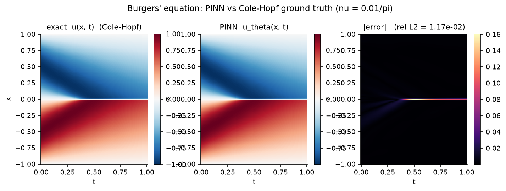
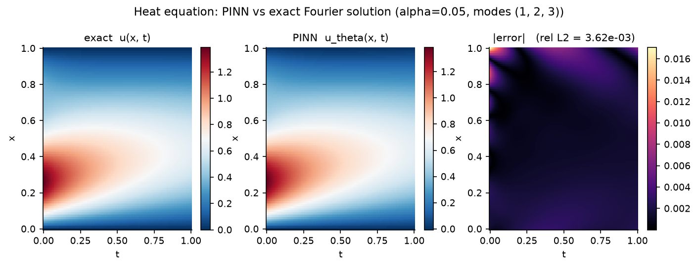
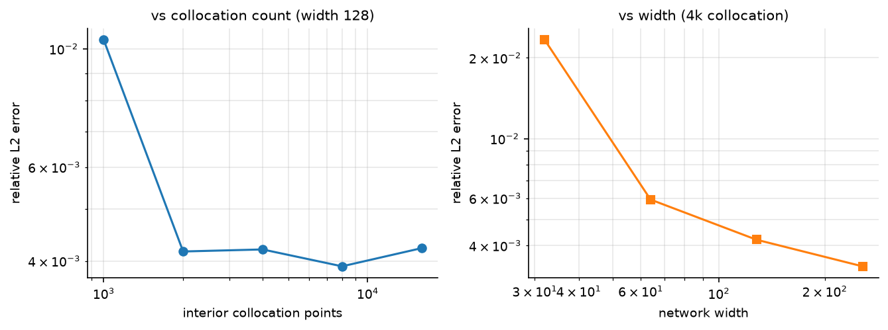
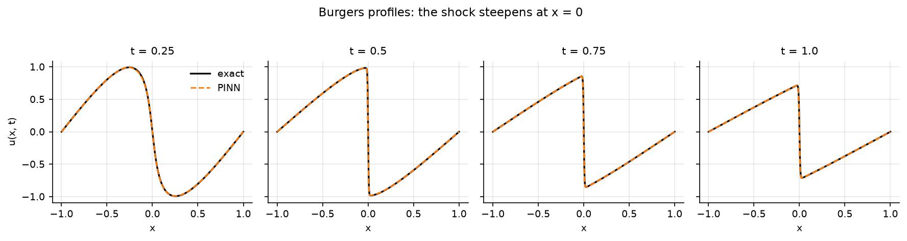
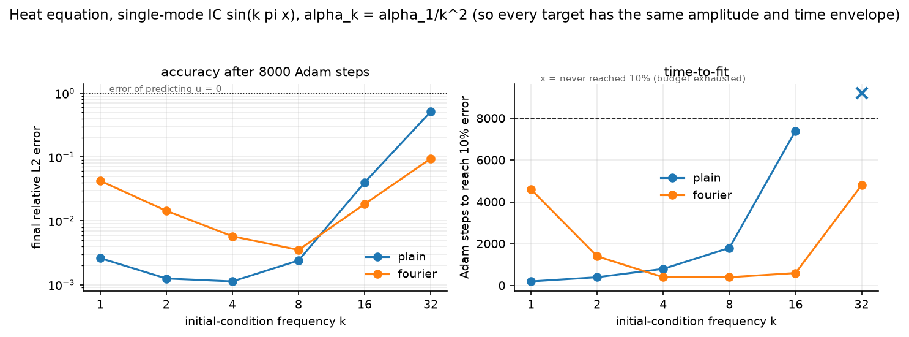
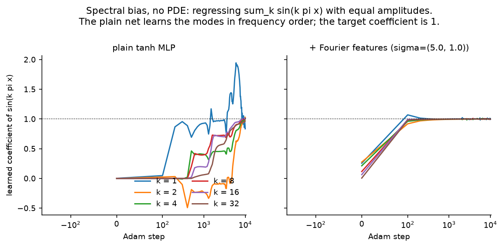
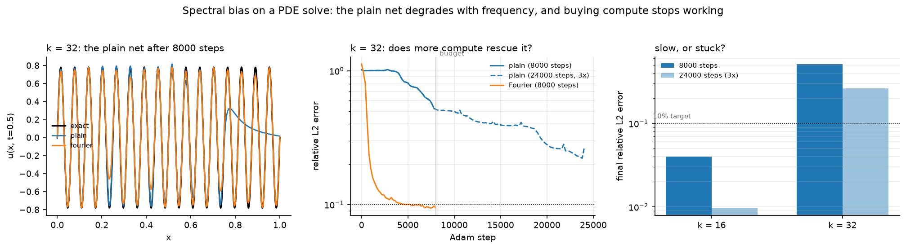

# pinn-from-scratch


Physics-informed neural networks built from the derivatives up, in PyTorch.
The network is a plain MLP; the PDE residual is formed from **exact autograd
derivatives** of that network — `u_t`, `u_x`, `u_xx` written out by hand in
[`pinn/derivatives.py`](pinn/derivatives.py) — and training minimizes a
weighted sum of the residual and the initial/boundary conditions. Every
problem here comes with a **closed-form or independently computed ground
truth**, so the PINN's error is always *measured against truth*, never
asserted.



*Viscous Burgers' equation, $u_t + u u_x = \nu u_{xx}$ with $\nu = 0.01/\pi$
and $u_0 = -\sin(\pi x)$ — the canonical PINN benchmark, whose smooth initial
condition steepens into a shock at $x=0$. Ground truth (left) is **not** a
grid solver: it is the exact Cole-Hopf transform evaluated by Gauss-Hermite
quadrature. The PINN (middle) reaches **1.17e-2** relative L2, and the error
(right) is not spread over the domain — it is a thin bright line exactly on
the shock.*

## What a PINN is, and why the derivatives are the whole story

A finite-difference or spectral solver stores $u$ on a grid and approximates
$u_{xx}$ by differencing neighbours. A PINN instead represents the solution as
a smooth function $u_\theta(x,t)$ — a neural network — and asks automatic
differentiation for its *exact* derivatives at arbitrary points. The PDE,
written as a residual $r(x,t) = 0$ (for the heat equation, $r = u_t - \alpha
u_{xx}$), becomes a loss:

$$\mathcal{L}(\theta) = w_r \overline{r(x_i,t_i)^2} \;+\; w_{ic}\, \overline{(u_\theta(x,0) - u_0)^2} \;+\; w_{bc}\, \overline{(u_\theta(\partial\Omega,t) - g)^2}.$$

Three consequences, each of which this repo tests rather than assumes:

- **There is no truncation error in the derivatives.** $u_{xx}$ is the true
  second derivative of the network, not an $O(h^2)$ stencil. The tests check
  the helpers against central differences *and* hand-derived closed forms on
  $u = \sin(ax)e^{-bt}$ — in float64, so the reference isn't float32 noise.
- **There is no grid**, so collocation points can be sampled anywhere, and the
  cost does not explode with dimension.
- **The minimization is nonconvex and the loss terms compete.** This is where
  PINNs actually fail, and §3 is a measured account of one such failure.

The activation is load-bearing: a ReLU network has $u_{xx} \equiv 0$ almost
everywhere and *cannot express a diffusion residual at all*. `tanh` is the
default for that reason, and there is a test asserting exactly this.

## Core modules

| module | what it does |
|---|---|
| [`pinn/model.py`](pinn/model.py) | `MLP` — tanh (default) or SIREN-style sine activations, Xavier / SIREN init, linear output head. `set_seed` for reproducibility. |
| [`pinn/derivatives.py`](pinn/derivatives.py) | `u_x`, `u_t`, `u_xx`, `u_tt`, `laplacian` via `torch.autograd.grad` with `create_graph=True` (so derivatives are themselves differentiable and can be composed into higher orders). The batch-diagonal-Jacobian trick is written out in the module docstring. |
| [`pinn/losses.py`](pinn/losses.py) | `residual_loss` (physics passed in as a callable), shared `data_loss` for IC/Dirichlet-BC, and reproducible uniform collocation samplers (`interior_points`, `initial_points`, `boundary_points`), each taking an explicit `torch.Generator`. |
| [`pinn/features.py`](pinn/features.py) | `FourierFeatures` — a fixed, non-trainable random Fourier map $\gamma(v) = [\cos 2\pi Bv,\ \sin 2\pi Bv]$ with per-coordinate $\sigma$ — and `FourierMLP`, a wrapper, so the plain MLP stays bit-for-bit unchanged and the §3 comparison is honest. |

The derivations behind all of it — the PINN loss, the heat Fourier series,
Cole-Hopf start to finish, spectral bias via the NTK — are written out in
[`theory/derivations.md`](theory/derivations.md).

## Results

### 1. The heat equation vs its exact Fourier series (`experiments/heat.py`)

$u_t = \alpha u_{xx}$ on $[0,1]^2$, homogeneous Dirichlet BCs, initial
condition a sum of three sine modes. The modes $\sin(k\pi x)$ are exactly the
Laplacian's eigenfunctions under these BCs, so the heat semigroup just
multiplies mode $k$ by $e^{-\alpha(k\pi)^2 t}$ and

$$u(x,t) = \sum_k a_k \sin(k\pi x)\, e^{-\alpha (k\pi)^2 t}$$

is an **exact closed form, not a truncation** — the error is measurable
pointwise, everywhere. The three modes decay at rates $1:4:9$, so the high
mode is gone by mid-time while the fundamental lingers: a clean multi-scale
target.

The default network (width 128, 4k interior points, 5k Adam steps) reaches
**relative L2 = 3.6e-3**. The two convergence sweeps say something more
interesting than "it converges":

| interior points | 1k | 2k | 4k | 8k | 16k |
|---|---|---|---|---|---|
| rel L2 | 1.04e-2 | 4.17e-3 | 4.20e-3 | 3.91e-3 | 4.23e-3 |

| width | 32 | 64 | 128 | 256 |
|---|---|---|---|---|
| rel L2 | 2.33e-2 | 5.93e-3 | 4.20e-3 | **3.35e-3** |

**Collocation error saturates by ~2k points; width keeps paying.** Adding 8×
more collocation points past 2k does nothing (4.17e-3 → 4.23e-3, i.e. noise),
while width falls monotonically ~7× from 32 to 256. On a target this smooth,
the binding constraint is the network's *capacity to represent the solution*,
not the density at which the physics is sampled. That is a statement about
this problem, not about PINNs in general — a solution with fine structure
would sample-starve at 2k points.

<p align="center"></p>
<p align="center"></p>

### 2. Burgers' equation via Cole-Hopf (`experiments/burgers.py`)

$u_t + u u_x = \nu u_{xx}$, $\nu = 0.01/\pi$, $u_0 = -\sin(\pi x)$ on
$[-1,1]$ — the standard PINN benchmark (Raissi et al. 2019), because the
smooth IC self-steepens into a near-shock at $x=0$ that a naive method smears.

The ground truth is the honest part. The **Cole-Hopf transform** $u = -2\nu\,
\phi_x/\phi$ linearizes Burgers into the *heat* equation (derived start to
finish in [`theory/derivations.md`](theory/derivations.md) §3), so $\phi$ is
the heat-kernel integral against the transformed IC $\phi_0 = e^{-F/2\nu}$.
Substituting $x-y = \sqrt{4\nu t}\,z$ turns the Gaussian factor into exactly
the $e^{-z^2}$ Gauss-Hermite weight, so the truth is evaluated **grid-free by
quadrature** — no discretization to confound the comparison. One numerical
catch, handled rather than hidden: $\phi_0 \sim e^{1/(\nu\pi)} \approx
e^{100}$ overflows, so the quadrature runs in log-space with a per-point max
subtracted (it cancels in the ratio).

Trained at width 48, depth 6, 10k collocation points, 20k Adam steps (~29 min
CPU):

| | value |
|---|---|
| relative L2 vs Cole-Hopf | **1.17e-2** |
| squared error inside the shock band $\|x\|\le 0.1$ (10% of the area) | **94%** |
| mean $\|$error$\|$: in-band vs out-of-band | 7.7e-3 vs 9.2e-4 (**8.3×**) |

**The error is the shock, and nothing else.** 10% of the domain holds 94% of
the squared error. Away from $x=0$ the PINN is accurate to ~1e-3; the smooth
regions are essentially solved and the entire difficulty is the thin steep
band — which is exactly what the hero figure shows and exactly what the
method's critics predict.

<p align="center"></p>

*Profile slices at $t = 0.25, 0.5, 0.75, 1.0$: the PINN tracks the steepening
front. The test suite pins the ground truth independently — it satisfies the
PDE by finite differences away from the shock, is odd in $x$, holds $u = 0$ at
$x \in \{-1, 0, 1\}$ by symmetry, and its slope at the origin steepens from
$-1.0$ to below $-50$.*

### 3. Spectral bias: the failure mode, measured (`experiments/spectral_bias.py`)

Neural networks learn low frequencies first. For a PINN that is not cosmetic —
it decides which PDEs are reachable at all. The setup: the same heat equation,
but a **single-mode** IC $\sin(k\pi x)$, one PDE per $k \in \{1,2,4,8,16,32\}$.

The load-bearing design choice is $\alpha_k = \alpha_1/k^2$, which cancels the
eigenvalue exactly ($\alpha_k (k\pi)^2 = \alpha_1\pi^2$) so **every target has
identical O(1) amplitude and the same time envelope**. Without it the high-$k$
solution decays to ~0, a network predicting $u = 0$ would score a *small*
error, and the experiment would confound frequency with amplitude — measuring
nothing.

Steps to reach 10% relative L2 (final error in parens), seed 0, width 64,
depth 4, 8000 Adam steps:

| $k$ | 1 | 2 | 4 | 8 | 16 | 32 |
|---|---|---|---|---|---|---|
| plain MLP | **200** (.003) | **400** (.001) | 800 (.001) | 1800 (.002) | 7400 (.040) | **never** (.515) |
| + Fourier features | 4600 (.042) | 1400 (.014) | **400** (.006) | **400** (.004) | **600** (.018) | **4800** (.094) |

<p align="center"></p>

Three findings, one of which overturned this experiment's own premise:

**(1) Spectral bias is graded, not a cliff.** Time-to-fit roughly doubles per
octave and then blows up. It is cleanest in the no-PDE regression diagnostic,
where the network just fits the modes directly — at step 200 the learned
coefficients are $k_1 = 0.868$, $k_2 = 0.031$, $k_4 = -8\text{e-}4$, $k_8 =
-1\text{e-}4$, $k_{16} = -1\text{e-}5$, $k_{32} = -1\text{e-}6$: **an order of
magnitude per octave**, all converging to ~1.0 by step 10k. The ordering lives
in the *trajectory*, not the endpoint.

<p align="center"></p>

**(2) The planned "failed run" at $k=16$ is not a failure.** At 3× budget it
goes .040 → **.0097** — merely slow. So the sweep was extended to $k=32$,
where 3× budget only reaches .515 → **.262** (still 2.6× above target, and
2.8× worse than Fourier features at a *third* the budget). $k=16$ is slow;
$k=32$ is stuck; **only the 3×-budget check distinguishes them**. Calling
$k=16$ a failure would have been unsupported by the data, and that is why the
control is in the repo.

**(3) The mitigation is a trade in both directions.** Fourier features are not
free: at $k=1$ the Fourier model is **23× slower** (4600 vs 200 steps) and 16×
less accurate, because $\sigma_x = 5$ hands the network frequencies the target
does not contain and the optimizer chases them. Crossover is at $k=4$. And at
$k=32$ it strains at its own band edge ($\sigma$ covers ~5 cycles/unit; $k=32$
needs 16). Both edges follow from fixing $\sigma$ **once for the whole sweep,
deliberately** — a mitigation retuned per frequency is the answer smuggled
into the prior.

<p align="center"></p>

The explanation is the NTK's eigenspectrum: gradient descent contracts the
error along eigendirection $i$ like $(1 - \eta\lambda_i)^s$, and the tanh
network's kernel has eigenvalues that decay fast with frequency, so high-$k$
error decays at a rate indistinguishable from zero within budget. The Fourier
embedding flattens that spectrum. Derived in
[`theory/derivations.md`](theory/derivations.md) §4, cross-linked to the
from-scratch NTK derivation in
[gp-from-scratch](https://github.com/porth-bot/gp-from-scratch) §6–7.

**Two measurement traps, caught and fixed rather than tuned around.** An
FFT-based spectral measure credited the plain MLP with a fake 13%
high-frequency tail — the solution is a smooth ramp on $[0,1]$ and the FFT's
periodicity assumption leaks a $1/f^2$ tail into every bin. It was replaced by
a sine-basis projection with the endpoint ramp subtracted, in the problem's
own Dirichlet eigenbasis. And the FD ground-truth check's tolerance is now
*derived* as the $O(h^2)$ truncation floor $\alpha_1\pi^4k^2h^2/12$ rather
than guessed (it is $k$-independent under the $\alpha_k$ scaling).

## Reproduce

```bash
python -m venv .venv && source .venv/bin/activate
pip install torch --index-url https://download.pytorch.org/whl/cpu
pip install -e ".[dev]"
pytest -q                       # 73 tests, ~35 s
cd experiments
python heat.py                  # ~25 min (default solve + both sweeps)
python burgers.py               # ~30 min (Cole-Hopf truth + PINN train)
python spectral_bias.py         # ~2 h   (12 PINN runs + regression + 3x controls)
```

Every script takes `--quick` for a fast smoke run. Figures land in `figures/`
and numbers in `logs/`, both committed — so every table above is regenerable
from the committed CSVs without retraining. Seeds are fixed; runtimes are
single-core CPU.

## Design notes

- **Tests assert the math, not the plumbing.** The derivative helpers are the
  foundation everything else rests on, so they are checked against central
  finite differences *and* hand-derived closed forms, in float64. Each ground
  truth is independently verified: the heat solution satisfies the PDE by FD
  and decays each mode at the right rate (isolated by projection); the
  Cole-Hopf solution satisfies the PDE by FD away from the shock — and the FD
  residual blows up *inside* the shock band, which is documented rather than
  papered over.
- **Ground truth is never a grid solver.** Exact Fourier series and Cole-Hopf
  quadrature. A discretized reference would confound the PINN's error with the
  reference's own.
- **Comparisons don't move two things at once.** `FourierMLP` wraps the plain
  `MLP` rather than modifying it, so the baseline in §3 is bit-for-bit the
  network from §1, and $\sigma$ is fixed once across the whole sweep.
- **The negative results are the point.** A repo where every number is good is
  a repo that stopped measuring.

## Limitations / next

- **On these problems, classical solvers win — decisively.** The 1D heat
  equation is solved to machine precision in milliseconds by a spectral method
  (it *is* the Fourier series of §1); the Cole-Hopf quadrature beats the ~30
  minute PINN train on speed and accuracy by orders of magnitude. For
  low-dimensional, smooth, well-posed forward problems on regular domains,
  finite differences / finite elements / spectral methods win on speed,
  accuracy, and convergence *guarantees* (the PINN offers a nonconvex loss and
  no error order). **This repo is a study of the method's mechanics and
  failure modes, not an argument that PINNs should solve these PDEs.**
- **Where PINNs actually earn their place** — inverse problems (recover $\nu$
  or $\alpha(x)$ from sparse data by adding one data term, no adjoint solver
  to hand-derive), high dimension (no mesh to explode), and irregular geometry
  — are **not demonstrated here**. The inverse problem is the top roadmap
  item, and it is the setting where PINNs are genuinely competitive.
- **Soft constraints only.** IC/BCs enter as penalty terms with hand-set
  weights, so they are satisfied approximately and the weights are a real
  tuning burden. Hard enforcement via a trial-function ansatz is a roadmap
  item.
- **Adam only, and 1D + time only.** L-BFGS is the classic PINN optimizer and
  is not implemented; no adaptive/residual-based collocation resampling; no 2D
  spatial problems.

## References

Raissi, Perdikaris & Karniadakis (2019) (the PINN formulation; the Burgers
benchmark); Cole (1951) and Hopf (1950) (the Cole-Hopf linearization);
Rahaman et al. (2019) (spectral bias); Jacot, Gabriel & Hongler (2018) (the
NTK behind §3, derived from scratch in gp-from-scratch); Tancik et al. (2020)
(random Fourier features); Wang, Wang & Perdikaris (2021) (the
eigenvalue-flattening argument for PINNs specifically); Sitzmann et al. (2020)
(SIREN). Full list with roles in
[`theory/derivations.md`](theory/derivations.md).

## Provenance

This is an **AI-assisted** study resource: the implementation was written with
Claude (Anthropic) as a from-scratch reference for learning how PINNs work,
with honest attribution. Every derivation is written out in
[`theory/derivations.md`](theory/derivations.md) and every non-obvious claim is
tested against a closed-form or independently computed ground truth rather than
taken on faith. Commits carry a `Co-Authored-By` trailer. Part of a
from-scratch series alongside
[gp-from-scratch](https://github.com/porth-bot/gp-from-scratch),
[mcmc-from-scratch](https://github.com/porth-bot/mcmc-from-scratch), and
[grokking-transformer](https://github.com/porth-bot/grokking-transformer).

*Suggested GitHub topics:* `physics-informed-neural-networks` `pinn` `pde`
`scientific-ml` `pytorch` `from-scratch`

## License

MIT — see [LICENSE](LICENSE).
