# pinn-from-scratch


Physics-informed neural networks built from the derivatives up, in PyTorch.
The network is a plain MLP; the PDE residual is formed from **exact autograd
derivatives** of that network — `u_t`, `u_x`, `u_xx` written out by hand in
[`pinn/derivatives.py`](pinn/derivatives.py) — and training minimizes a
weighted sum of the residual and the initial/boundary conditions. Every
problem here comes with a **closed-form or independently computed ground
truth**, so the PINN's error is always *measured against truth*, never
asserted.

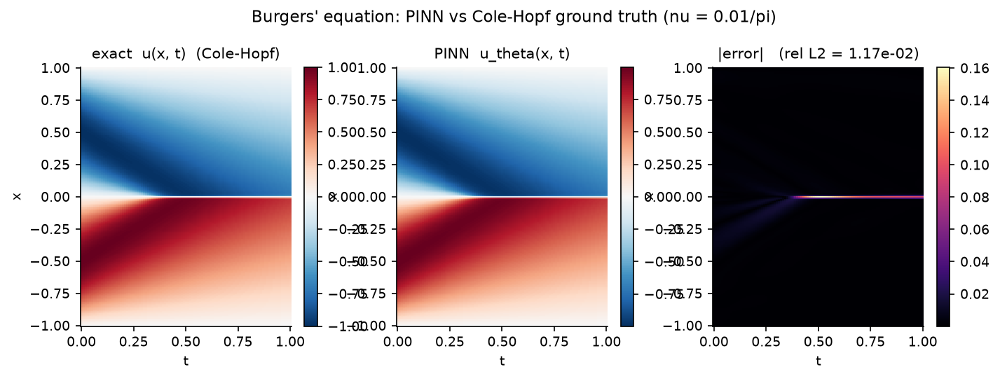

*Viscous Burgers' equation, $u_t + u u_x = \nu u_{xx}$ with $\nu = 0.01/\pi$
and $u_0 = -\sin(\pi x)$ — the canonical PINN benchmark, whose smooth initial
condition steepens into a shock at $x=0$. Ground truth (left) is **not** a
grid solver: it is the exact Cole-Hopf transform evaluated by Gauss-Hermite
quadrature. The PINN (middle) reaches **1.17e-2** relative L2, and the error
(right) is not spread over the domain — it is a thin bright line exactly on
the shock.*

## What a PINN is, and why the derivatives are the whole story

A finite-difference or spectral solver stores $u$ on a grid and approximates
$u_{xx}$ by differencing neighbours. A PINN instead represents the solution as
a smooth function $u_\theta(x,t)$ — a neural network — and asks automatic
differentiation for its *exact* derivatives at arbitrary points. The PDE,
written as a residual $r(x,t) = 0$ (for the heat equation, $r = u_t - \alpha
u_{xx}$), becomes a loss:

$$\mathcal{L}(\theta) = w_r \overline{r(x_i,t_i)^2} \;+\; w_{ic}\, \overline{(u_\theta(x,0) - u_0)^2} \;+\; w_{bc}\, \overline{(u_\theta(\partial\Omega,t) - g)^2}.$$

Three consequences, each of which this repo tests rather than assumes:

- **There is no truncation error in the derivatives.** $u_{xx}$ is the true
  second derivative of the network, not an $O(h^2)$ stencil. The tests check
  the helpers against central differences *and* hand-derived closed forms on
  $u = \sin(ax)e^{-bt}$ — in float64, so the reference isn't float32 noise.
- **There is no grid**, so collocation points can be sampled anywhere, and the
  cost does not explode with dimension.
- **The minimization is nonconvex and the loss terms compete.** This is where
  PINNs actually fail, and §3 is a measured account of one such failure.

The activation is load-bearing: a ReLU network has $u_{xx} \equiv 0$ almost
everywhere and *cannot express a diffusion residual at all*. `tanh` is the
default for that reason, and there is a test asserting exactly this.

## Core modules

| module | what it does |
|---|---|
| [`pinn/model.py`](pinn/model.py) | `MLP` — tanh (default) or SIREN-style sine activations, Xavier / SIREN init, linear output head. `set_seed` for reproducibility. |
| [`pinn/derivatives.py`](pinn/derivatives.py) | `u_x`, `u_t`, `u_xx`, `u_tt`, `laplacian` via `torch.autograd.grad` with `create_graph=True` (so derivatives are themselves differentiable and can be composed into higher orders). The batch-diagonal-Jacobian trick is written out in the module docstring. |
| [`pinn/losses.py`](pinn/losses.py) | `residual_loss` (physics passed in as a callable), shared `data_loss` for IC/Dirichlet-BC, reproducible uniform collocation samplers (`interior_points`, `initial_points`, `boundary_points`), and `adaptive_interior_points` — residual-adaptive resampling (RAD; Wu et al. 2023) that pulls points toward large-residual regions like the Burgers shock (§5). Each takes an explicit `torch.Generator`. |
| [`pinn/features.py`](pinn/features.py) | `FourierFeatures` — a fixed, non-trainable random Fourier map $\gamma(v) = [\cos 2\pi Bv,\ \sin 2\pi Bv]$ with per-coordinate $\sigma$ — and `FourierMLP`, a wrapper, so the plain MLP stays bit-for-bit unchanged and the §3 comparison is honest. |

The derivations behind all of it — the PINN loss, the heat Fourier series,
Cole-Hopf start to finish, spectral bias via the NTK — are written out in
[`theory/derivations.md`](theory/derivations.md).

## Results

### 1. The heat equation vs its exact Fourier series (`experiments/heat.py`)

$u_t = \alpha u_{xx}$ on $[0,1]^2$, homogeneous Dirichlet BCs, initial
condition a sum of three sine modes. The modes $\sin(k\pi x)$ are exactly the
Laplacian's eigenfunctions under these BCs, so the heat semigroup just
multiplies mode $k$ by $e^{-\alpha(k\pi)^2 t}$ and

$$u(x,t) = \sum_k a_k \sin(k\pi x)\, e^{-\alpha (k\pi)^2 t}$$

is an **exact closed form, not a truncation** — the error is measurable
pointwise, everywhere. The three modes decay at rates $1:4:9$, so the high
mode is gone by mid-time while the fundamental lingers: a clean multi-scale
target.

The default network (width 128, 4k interior points, 5k Adam steps) reaches
**relative L2 = 3.6e-3**. The two convergence sweeps below hold the optimizer
budget at **3k steps** instead, so that a cell differs from its neighbours in
one thing only; that shorter budget is why the width-128 / 4k-point cell they
share reads 4.20e-3 rather than the headline 3.6e-3. It reads
$4.202991\times10^{-3}$ in *both* logs, to every digit — the same seeded run,
which is the cheapest available check that the two sweeps are comparable at
all. They say something more interesting than "it converges":

| interior points | 1k | 2k | 4k | 8k | 16k |
|---|---|---|---|---|---|
| rel L2 | 1.04e-2 | 4.17e-3 | 4.20e-3 | 3.91e-3 | 4.23e-3 |

| width | 32 | 64 | 128 | 256 |
|---|---|---|---|---|
| rel L2 | 2.33e-2 | 5.93e-3 | 4.20e-3 | **3.35e-3** |

**Collocation error saturates by ~2k points; width keeps paying.** Adding 8×
more collocation points past 2k does nothing (4.17e-3 → 4.23e-3, i.e. noise),
while width falls monotonically ~7× from 32 to 256. On a target this smooth,
the binding constraint is the network's *capacity to represent the solution*,
not the density at which the physics is sampled. That is a statement about
this problem, not about PINNs in general — a solution with fine structure
would sample-starve at 2k points.

**Every number above is a final iterate, and Adam has not settled.** The
committed `logs/heat_training.csv` reads 3.43e-3, 2.41e-2, 4.83e-2, 3.62e-3 at
steps 3500–5000, so even the headline 3.6e-3 is one sample of an oscillation
with a 14× band. `python experiments/heat.py --tail` re-runs each width cell and
evaluates it every 100 steps over the last 1000 (`logs/heat_tail.csv`). Every
cell reproduces its table entry exactly, and every cell has a band:

| width | 32 | 64 | 128 | 256 |
|---|---|---|---|---|
| reported (step 3000) | 2.33e-2 | 5.93e-3 | 4.20e-3 | 3.35e-3 |
| min–max over steps 2000–3000 | 7.7e-3 – 2.3e-2 | 5.9e-3 – 6.9e-2 | 4.2e-3 – 7.0e-3 | 3.3e-3 – 7.6e-2 |
| band | 3.0× | 11.7× | 1.7× | 22.8× |

**All four bands overlap their neighbours, so the 7× monotone fall in width is
not resolved by single final iterates.** The trend may well be real — three of
the four cells report at or near their own band minimum, and the widest network
reaches the lowest error seen anywhere — but this table does not establish it,
and settling it needs seed averaging that has not been run here. What the
measurement does settle is the *collocation* reading, in its favour: those
differences (4.17e-3 → 4.23e-3) are far inside this band, which is exactly what
"i.e. noise" claimed.

This is one seed's tail, not a seed study. The high-dimensional work in
`experiments/highd_heat.py` avoids the problem a different way — it returns the
iterate with the lowest *training* loss, which is selection on the objective
and uses no ground truth, so nothing about the exact solution leaks into the
choice.

<p align="center">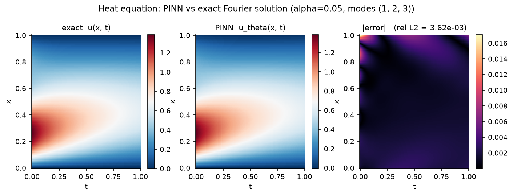</p>
<p align="center">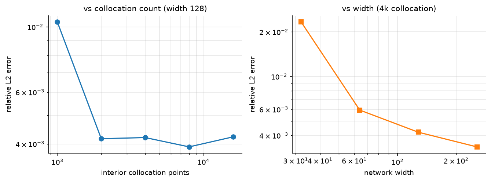</p>

### 2. Burgers' equation via Cole-Hopf (`experiments/burgers.py`)

$u_t + u u_x = \nu u_{xx}$, $\nu = 0.01/\pi$, $u_0 = -\sin(\pi x)$ on
$[-1,1]$ — the standard PINN benchmark (Raissi et al. 2019), because the
smooth IC self-steepens into a near-shock at $x=0$ that a naive method smears.

The ground truth is the honest part. The **Cole-Hopf transform** $u = -2\nu\,
\phi_x/\phi$ linearizes Burgers into the *heat* equation (derived start to
finish in [`theory/derivations.md`](theory/derivations.md) §3), so $\phi$ is
the heat-kernel integral against the transformed IC $\phi_0 = e^{-F/2\nu}$.
Substituting $x-y = \sqrt{4\nu t}\,z$ turns the Gaussian factor into exactly
the $e^{-z^2}$ Gauss-Hermite weight, so the truth is evaluated **grid-free by
quadrature** — no discretization to confound the comparison. One numerical
catch, handled rather than hidden: $\phi_0 \sim e^{1/(\nu\pi)} \approx
e^{100}$ overflows, so the quadrature runs in log-space with a per-point max
subtracted (it cancels in the ratio).

Trained at width 48, depth 6, 10k collocation points, 20k Adam steps (~29 min
CPU):

| | value |
|---|---|
| relative L2 vs Cole-Hopf | **1.17e-2** |
| squared error inside the shock band $\|x\|\le 0.1$ (10% of the area) | **94%** |
| mean $\|$error$\|$: in-band vs out-of-band | 7.7e-3 vs 9.2e-4 (**8.3×**) |

**The error is the shock, and nothing else.** 10% of the domain holds 94% of
the squared error. Away from $x=0$ the PINN is accurate to ~1e-3; the smooth
regions are essentially solved and the entire difficulty is the thin steep
band — which is exactly what the hero figure shows and exactly what the
method's critics predict.

<p align="center">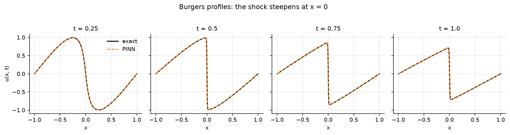</p>

*Profile slices at $t = 0.25, 0.5, 0.75, 1.0$: the PINN tracks the steepening
front. The test suite pins the ground truth independently — it satisfies the
PDE by finite differences away from the shock, is odd in $x$, holds $u = 0$ at
$x \in \{-1, 0, 1\}$ by symmetry, and its slope at the origin steepens from
$-1.0$ to below $-50$.*

### 3. Spectral bias: the failure mode, measured (`experiments/spectral_bias.py`)

Neural networks learn low frequencies first. For a PINN that is not cosmetic —
it decides which PDEs are reachable at all. The setup: the same heat equation,
but a **single-mode** IC $\sin(k\pi x)$, one PDE per $k \in \{1,2,4,8,16,32\}$.

The load-bearing design choice is $\alpha_k = \alpha_1/k^2$, which cancels the
eigenvalue exactly ($\alpha_k (k\pi)^2 = \alpha_1\pi^2$) so **every target has
identical O(1) amplitude and the same time envelope**. Without it the high-$k$
solution decays to ~0, a network predicting $u = 0$ would score a *small*
error, and the experiment would confound frequency with amplitude — measuring
nothing.

Steps to reach 10% relative L2 (final error in parens), seed 0, width 64,
depth 4, 8000 Adam steps:

| $k$ | 1 | 2 | 4 | 8 | 16 | 32 |
|---|---|---|---|---|---|---|
| plain MLP | **200** (.003) | **400** (.001) | 800 (.001) | 1800 (.002) | 7400 (.040) | **never** (.515) |
| + Fourier features | 4600 (.042) | 1400 (.014) | **400** (.006) | **400** (.004) | **600** (.018) | **4800** (.094) |

<p align="center">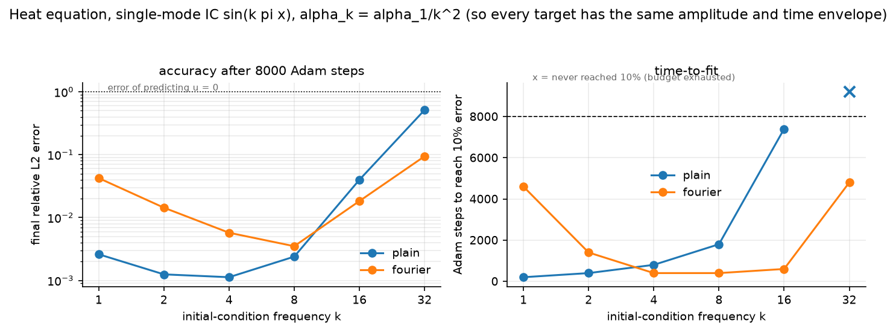</p>

Three findings, one of which overturned this experiment's own premise:

**(1) Spectral bias is graded, not a cliff.** Time-to-fit roughly doubles per
octave and then blows up. It is cleanest in the no-PDE regression diagnostic,
where the network just fits the modes directly — at step 200 the learned
coefficients are $k_1 = 0.868$, $k_2 = 0.031$, $k_4 = -8\text{e-}4$, $k_8 =
-1\text{e-}4$, $k_{16} = -1\text{e-}5$, $k_{32} = -1\text{e-}6$: **an order of
magnitude per octave**, all converging to ~1.0 by step 10k. The ordering lives
in the *trajectory*, not the endpoint.

<p align="center">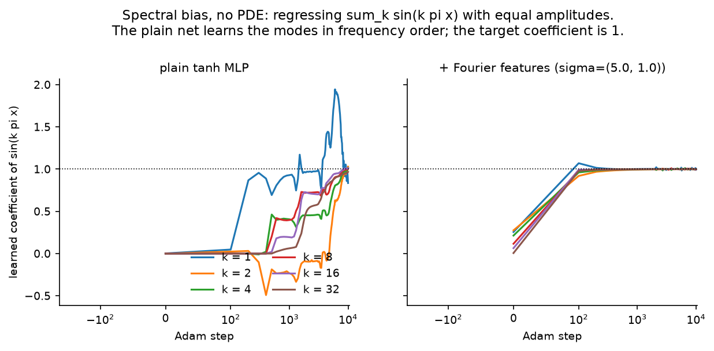</p>

**(2) The planned "failed run" at $k=16$ is not a failure.** At 3× budget it
goes .040 → **.0097** — merely slow. So the sweep was extended to $k=32$,
where 3× budget only reaches .515 → **.262** (still 2.6× above target, and
2.8× worse than Fourier features at a *third* the budget). $k=16$ is slow;
$k=32$ is stuck; **only the 3×-budget check distinguishes them**. Calling
$k=16$ a failure would have been unsupported by the data, and that is why the
control is in the repo.

**(3) The mitigation is a trade in both directions.** Fourier features are not
free: at $k=1$ the Fourier model is **23× slower** (4600 vs 200 steps) and 16×
less accurate, because $\sigma_x = 5$ hands the network frequencies the target
does not contain and the optimizer chases them. Crossover is at $k=4$. And at
$k=32$ it strains at its own band edge ($\sigma$ covers ~5 cycles/unit; $k=32$
needs 16). Both edges follow from fixing $\sigma$ **once for the whole sweep,
deliberately** — a mitigation retuned per frequency is the answer smuggled
into the prior.

<p align="center">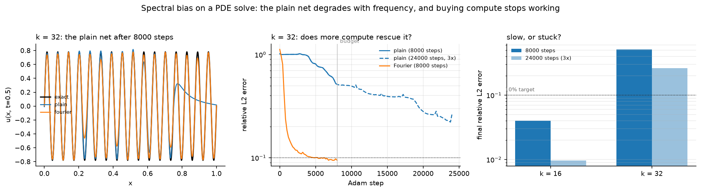</p>

The explanation is the NTK's eigenspectrum: gradient descent contracts the
error along eigendirection $i$ like $(1 - \eta\lambda_i)^s$, and the tanh
network's kernel has eigenvalues that decay fast with frequency, so high-$k$
error decays at a rate indistinguishable from zero within budget. The Fourier
embedding flattens that spectrum. Derived in
[`theory/derivations.md`](theory/derivations.md) §4, cross-linked to the
from-scratch NTK derivation in
[gp-from-scratch](https://github.com/porth-bot/gp-from-scratch) §6–7.

**Two measurement traps, caught and fixed rather than tuned around.** An
FFT-based spectral measure credited the plain MLP with a fake 13%
high-frequency tail — the solution is a smooth ramp on $[0,1]$ and the FFT's
periodicity assumption leaks a $1/f^2$ tail into every bin. It was replaced by
a sine-basis projection with the endpoint ramp subtracted, in the problem's
own Dirichlet eigenbasis. And the FD ground-truth check's tolerance is now
*derived* as the $O(h^2)$ truncation floor $\alpha_1\pi^4k^2h^2/12$ rather
than guessed (it is $k$-independent under the $\alpha_k$ scaling).

### 4. Optimizer: our Adam vs torch L-BFGS (`experiments/optimizer_study.py`)

Every experiment above trains with Adam, but the PINN literature's default
recipe is **Adam then L-BFGS** — first-order to find a basin, then a
quasi-Newton method that uses curvature to polish the smooth, low-dimensional
PINN loss. This compares the two on the heat problem with everything but the
optimizer held fixed (same init, same fixed collocation, same loss). Cost is in
*loss-and-gradient evaluations* — Adam does one per step; L-BFGS calls its
closure several times per iteration for the strong-Wolfe line search, so a
per-step axis would flatter it. (Same honest per-evaluation accounting as the
ESS-per-gradient axis in the sibling [mcmc-from-scratch](https://github.com/porth-bot/mcmc-from-scratch).)

| regime | evals to converge | wall-clock | final rel L2 |
|---|---|---|---|
| Adam (8k steps) | 8 000 | 106 s | 2.42e-3 |
| L-BFGS (from init) | **673** | **9.8 s** | 2.27e-3 |
| hybrid (Adam 1k → L-BFGS) | 1 655 | 23 s | **2.25e-3** |

L-BFGS reaches the **same** ~2.3e-3 accuracy as Adam using ~12× fewer
evaluations and ~11× less wall-clock — curvature information is worth a lot on a
loss this smooth. Two honest caveats the numbers force: (1) on *this* easy,
convex-basin target pure L-BFGS from init is enough — the Adam warmup buys the
hybrid only a hair more accuracy and costs more than L-BFGS alone here; its real
value is on stiffer losses (the Burgers shock, high-$k$ spectral-bias runs)
where L-BFGS from a cold init can stall in a bad minimum. (2) Adam's error
*oscillates* late in training (visible as spikes below), while L-BFGS descends
monotonically then flattens — the line search rejects uphill steps.

<p align="center">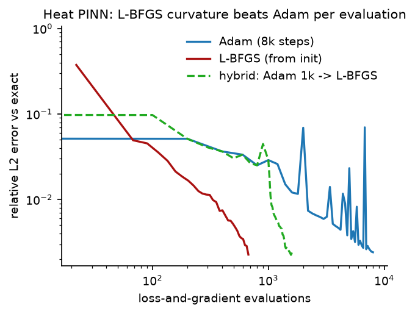</p>

### 5. Residual-adaptive collocation: a failure mode and its fix (`experiments/adaptive_collocation.py`)

Uniform collocation spreads its points evenly, but Burgers puts ~94% of its
error in the thin shock at $x=0$ (§2) — the region a uniform sample least
resolves. The obvious fix is to move points to where the residual is large
(`pinn.losses.adaptive_interior_points`, residual-density sampling; RAD, Wu et
al. 2023). The instructive result is that *how* you move them decides whether it
helps at all. Three arms, same 3000-point budget, sharing a bit-identical
uniform warmup so they branch from one state (rel L2 $\approx 0.21$ at step 5000):

| arm | rel L2 | shock-band \|err\| ($\lvert x\rvert\le0.1$) | off-shock \|err\| |
|---|---|---|---|
| **U** uniform (keep the set) | 2.10e-1 | 1.83e-1 | 1.89e-2 |
| **R** resample (replace the set by density) | **4.58e-1** | **5.54e-1** | 2.51e-2 |
| **A** RAR (add density points to the base) | **1.61e-1** | **1.24e-1** | 1.08e-2 |

<p align="center">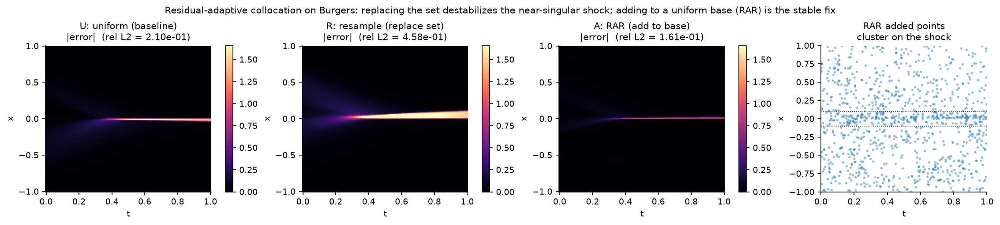</p>

**Replacing the whole set makes things worse, badly.** Burgers' residual is
near-singular at the shock (it carries $u_{xx}\sim\mathcal O(100)$), so a set
drawn $\propto\lvert r\rvert$ piles points onto the least-tractable region; the
loss is dominated by them, the smooth region loses coverage, and a model at rel
L2 $\approx0.21$ collapses to $0.46$ (its shock error *triples*) — measured
directly: within ~50 steps of the first resample the fit jumps from 0.03-class
to 0.86 on a longer clean run. **RAR fixes it by never removing the uniform
base**: keep the base, *add* density-drawn points (matched to the same total),
and the smooth region stays covered while the extra points sharpen the shock —
rel L2 falls to 0.16 (−23%) and shock-band error to 0.12 (−32%), with 25% of the
added points landing in $\lvert x\rvert\le0.1$ vs the ~10% a uniform draw gives.
The only difference between R and A is replace-vs-add.

Two honest notes. The absolute errors here are well above the flagship Burgers
run's 1.2e-2 (§2): this uses a smaller net and a shorter budget so three arms are
affordable, and the point is the *relative* effect of the collocation strategy,
which the shared warmup isolates. And RAD is not intrinsically bad — full-set
resampling on this near-singular target is; on smoother problems, or from a
sufficiently converged state, replacement is stable too. RAR is simply the safe
default here.

### 6. The classical baseline: Crank-Nicolson finite differences (`experiments/crank_nicolson.py`)

The limitations section says classical solvers win here decisively. This makes
it a number, not a claim. The *same* heat problem — same $\alpha$, same
three-mode IC, same Dirichlet BCs — is solved by a textbook second-order scheme:
Crank-Nicolson (trapezoidal-in-time central differences), one tridiagonal solve
per step via a from-scratch Thomas algorithm, unconditionally stable so the time
step is not tied to $dx^2$. Accuracy against the same exact solution, at four
grid resolutions, with wall-clock:

| method | grid | rel L2 | wall-clock | order |
|---|---|---|---|---|
| Crank-Nicolson | 20×20 | 1.74e-3 | **0.25 ms** | — |
| Crank-Nicolson | 40×40 | 4.37e-4 | 0.87 ms | 1.99 |
| Crank-Nicolson | 80×80 | 1.10e-4 | 3.3 ms | 2.00 |
| Crank-Nicolson | 160×160 | 2.75e-5 | 13 ms | 2.00 |
| **PINN** (Adam, §4) | — | 2.42e-3 | **106 s** | (none) |

<p align="center">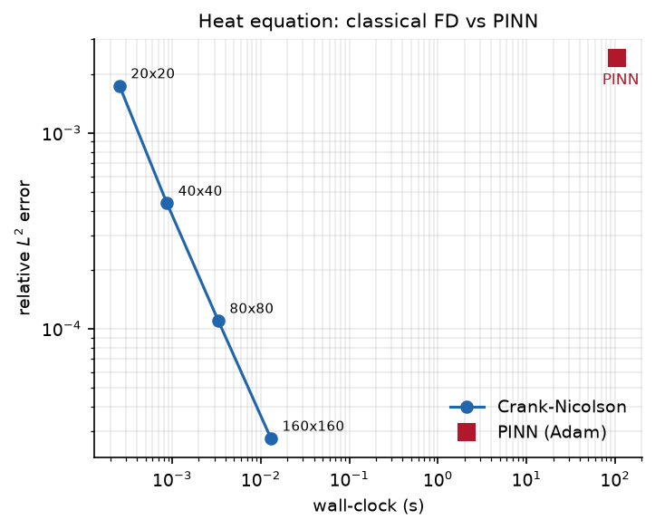</p>

**The coarsest 20×20 grid already beats the PINN's accuracy (1.7e-3 vs 2.4e-3)
at roughly $4\times10^{5}$ less wall-clock** (0.25 ms vs 106 s). And the two
curves go opposite ways: CN's error falls a clean factor of ~4 per refinement
(the measured convergence order is 2.00 — the FD scheme comes with a guarantee),
so it drives the error arbitrarily low for a few more milliseconds, while the
PINN's nonconvex loss plateaus near $10^{-3}$ and buys nothing from more compute.
This is the concrete backing for the first limitation below: for a smooth,
low-dimensional, well-posed forward problem, there is no contest. The PINN's case
is inverse/high-dimensional/mesh-free problems — none of which this is.

### 7. Hard boundary/initial conditions: a trial-function ansatz (`experiments/hard_bc.py`)

Every solve above enforces the IC and BCs the *soft* way — add
$w_{\text{ic}}\lVert u-g\rVert^2 + w_{\text{bc}}\lVert u\rVert^2$ to the residual
loss — so the constraints hold only approximately and the weights are a real
knob (the theory doc §1, §5 calls them out). The classical alternative (Lagaris,
Likas & Fotiadis 1998) is to build the constraints into the *function space*. For
this heat problem — $u(x,0)=g(x)$, $u(0,t)=u(1,t)=0$ — write

$$u_\theta(x,t) = g(x) + x\,(1-x)\,t\,N_\theta(x,t).$$

Both conditions are then exact for **any** network weights: at $t=0$ the factor
$t$ kills the correction so $u_\theta=g$; at $x\in\{0,1\}$ the factor $x(1-x)$
kills it so $u_\theta=g=0$ (the sine IC already vanishes at the walls). The IC/BC
loss terms disappear — the ansatz trains the residual alone, no weights. Same
architecture, same seed (bit-identical init), same collocation, same optimizer;
the only differences are the two the method is about.

| method | rel $L^2$ (best) | rel $L^2$ (final) | IC error | BC error | weights to tune |
|---|---|---|---|---|---|
| soft (residual + IC + BC) | 3.4e-3 | 3.6e-3 | 1.7e-2 | 1.7e-2 | 2 |
| **hard (ansatz, residual only)** | **2.4e-4** | 5.0e-3 | **0** | **6e-9** | **0** |

<p align="center">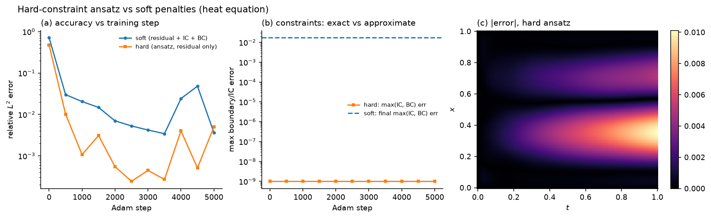</p>

Two clean wins and one honest caveat. **(1)** The constraints are exact — IC to
zero, BC at the float32 floor — against the soft penalty's $1.7\times10^{-2}$,
and there is no weight to balance. **(2)** On accuracy the *trajectory* (panel a)
is the honest read: the ansatz reaches the soft run's lifetime-best error by
~step 700 (≈5× sooner) and bottoms out ~14× deeper ($2.4\times10^{-4}$ vs
$3.4\times10^{-3}$), because the IC/BC data no longer competes with the residual
in a weighted sum — the whole loss is the physics. **The caveat:** on this easy,
smooth problem both eventually plateau in the low-$10^{-3}$/$10^{-4}$ range and
both show late Adam oscillation, so the single *final-step* number is noisy
(hard's endpoint lands on an up-bounce and reads *worse* than soft's — which is
exactly why the honest column is *best*, not *final*). And the ansatz has a
cost the soft penalty does not: it must be hand-derived per problem (here it
needs the analytic $g$ and a boundary-vanishing envelope), whereas a penalty
term is added mechanically to any BC. Hard constraints remove a tuning knob and
guarantee exactness; they do not come free.

### 8. The inverse problem: recover the coefficient from noisy data (`experiments/inverse.py`)

Everything above is a *forward* problem, and §6 says plainly that a classical
solver wins those. This is the other direction, and it is the setting PINNs are
actually built for: the same heat problem, but $\alpha$ is **unknown** and the
only information is $N$ scattered noisy samples $y_i = u(x_i,t_i) + \varepsilon_i$.
No initial condition, no boundary condition — in an inverse problem the data
replaces them, and a finite-difference solver has nothing to march from.

The change to a PINN is one `nn.Parameter` and one extra entry in the
optimizer's list, because $\alpha$ already sits inside a term autograd is
differentiating:

$$L(\theta, \alpha) = \big\langle (u_t - \alpha u_{xx})^2 \big\rangle_{\text{collocation}} + w_d \big\langle (u_\theta - y)^2 \big\rangle_{\text{data}}.$$

We optimize $\log\alpha$, so $\alpha>0$ by construction and a step is a
*relative* change — necessary because the run starts deliberately wrong, at
$4\alpha$. The classical route to the same answer is an outer loop over full
forward solves, or a hand-derived adjoint.

Starting from $\alpha = 0.2$, with 200 samples at $\sigma = 0.02$ (2% of the
initial amplitude), the recovered value is $\hat\alpha = 0.0509$ against a true
0.05 — **1.9%** — and most of the trip happens in the first 1,000 of 6,000 Adam
steps ($0.2006 \to 0.0660 \to 0.0523$ at steps 0, 500, 1,000):

| $\sigma$ (at $N=200$) | 0 | 0.01 | 0.05 | 0.1 |
| --- | ---: | ---: | ---: | ---: |
| $\hat\alpha$ | 0.0498 | 0.0503 | 0.0526 | 0.0554 |
| error in $\alpha$ | 0.5% | 0.7% | 5.2% | **10.8%** |

| $N$ (at $\sigma=0.02$) | 25 | 50 | 100 | 200 | 400 |
| --- | ---: | ---: | ---: | ---: | ---: |
| error in $\alpha$ | 6.3% | 1.0% | 0.7% | 1.9% | 0.6% |

| window $t \leq t_{\max}$ | 0.1 | 0.25 | 0.5 | 1.0 |
| --- | ---: | ---: | ---: | ---: |
| error in $\alpha$ | 7.1% | 4.3% | 3.2% | 1.9% |

<p align="center">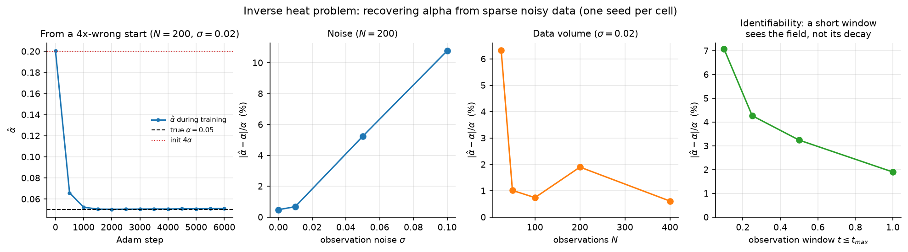</p>

Three honest readings.

**Noise passes through roughly one-for-one.** Doubling $\sigma$ from 0.05 to 0.1
doubles the error, 5.2% → 10.8%, and the whole sweep is close to
$|\Delta\alpha|/\alpha \approx \sigma$ in units of the solution's amplitude. That
is the useful summary: this method does not amplify observation noise, and it
does not average it away either.

**Data volume saturates immediately.** 25 points is visibly short (6.3%);
from 50 on, every cell is between 0.6% and 1.9% and the ordering inside that
range is not meaningful — these are **single-seed** runs and 1–2% is the
run-to-run scatter of the Adam trajectory (visible directly in the trace's late
wobble, panel a). The claim is "tens of points suffice here", not "400 beats
200".

**Identifiability is about the time window, not the point count.** The heat
equation has an exact degeneracy, $u(x,t;\alpha) = u(x,\alpha t;1)$: scaling
$\alpha$ is rescaling time. So $\alpha$ is recoverable only from *absolute*
time labels, and only insofar as the observations span enough time for the decay
envelope $e^{-\alpha(k\pi)^2 t}$ to show. Shrink the window with the point count
and noise fixed and the error grows monotonically, 1.9% → 7.1%, with the field
error growing alongside it (0.9% → 3.1%). Same data volume, less information.

The control that says which term is doing the work: set $w_d = 0$ and the
objective is the residual alone, which *every* solution of the heat equation
satisfies for its own $\alpha$ — including $u \equiv 0$, which satisfies it for
all of them. The optimizer duly returns a flat field and leaves $\alpha$ at its
initialization — in the short configuration the test uses, $0.194$ against a
true 0.05 with 96% field error.
`tests/test_inverse.py` asserts exactly that, next to the identity that makes
recovery possible in the first place: on the true solution the residual measured
with a wrong diffusivity is exactly $(\alpha_{\text{true}} - \alpha)\,u_{xx}$.

One caveat worth stating: the recovered *field* here (0.9–4.5% relative $L^2$) is
worse than the forward solve's 0.36% in §1, and it should be — it is fitted to
200 noisy points with no boundary data instead of to an exactly known IC/BC.

### 9. What the loss weights actually decide (`experiments/loss_weighting.py`)

§7 calls $w_{\text{ic}}$ and $w_{\text{bc}}$ "a real knob" and the theory doc
§1 calls balancing them "a genuine difficulty", and every solve above has run at
$w_{\text{ic}}=w_{\text{bc}}=1$ without measuring what that choice costs. This
does: 60 solves, three seeds each, scored against the exact Fourier solution.

Two metrics, because one is not enough. Relative $L^2$ saturates near 1 for
*any* badly wrong field, so it cannot separate "fit the wrong shape" from
"learned nothing"; the amplitude ratio
$\lVert u_\theta\rVert / \lVert u_{\text{exact}}\rVert$ can — a collapse reads
$\approx 0$, a merely-bad fit reads $\approx 1$.

<p align="center">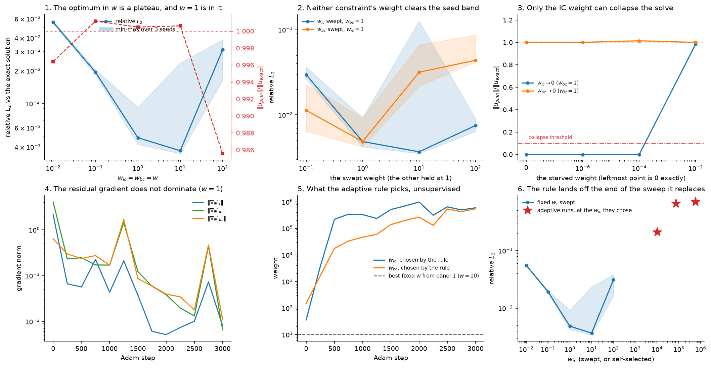</p>

**The seed spread sets the resolution, so it goes first.** The widest
single-arm band over three seeds is $6.8\times$ ($w=10$: 0.0035 to 0.0235).
Any weight effect smaller than that is not measurable here, and reporting one
would be reading noise.

| $w_{\text{ic}}=w_{\text{bc}}=w$ | 0.01 | 0.1 | 1 | 10 | 100 |
| --- | ---: | ---: | ---: | ---: | ---: |
| rel $L^2$ (median) | 0.0556 | 0.0193 | **0.0049** | **0.0037** | 0.0311 |
| amplitude ratio | 0.996 | 1.001 | 1.000 | 1.001 | 0.986 |

**(1) No weight in four decades breaks the solve, and $w=1$ is already inside
the optimum.** The sweep spans $15\times$ in median error (0.0556 at $w=0.01$,
down to 0.0037 at $w=10$, back up to 0.0311 at $w=100$) — a real effect, but
only about twice the seed spread, and with no collapse anywhere: the amplitude
ratio never leaves [0.986, 1.001]. The best median is $w=10$, but its seed band
[0.0035, 0.0235] overlaps $w=1$'s [0.0042, 0.0092], so the repo's default was
never measurably costing anything. **(2) Sweeping the two weights separately cannot
resolve the difference between them**: $8.1\times$ across the $w_{\text{ic}}$
sweep and $3.9\times$ across the $w_{\text{bc}}$ sweep, both against that
$6.8\times$ seed spread. A single-seed version of this arm would have produced
a confident ordering out of noise.

**(3) The predicted failure is real, and it is a cliff three decades below any
weight anyone would write.** $u\equiv 0$ solves the PDE exactly and satisfies
the homogeneous walls exactly, so the initial condition is the only term ruling
it out (`tests/test_loss_weighting.py` checks all three directly, on a real
network with its output layer zeroed). Starving each constraint in turn, down
to exactly 0:

| starved weight | $10^{-2}$ | $10^{-4}$ | $10^{-6}$ | 0 |
| --- | ---: | ---: | ---: | ---: |
| $w_{\text{ic}}\to 0$: amplitude ratio | 0.986 | 0.001 | 0.000 | **0.000** |
| $w_{\text{ic}}\to 0$: rel $L^2$ | 0.0836 | 0.9994 | 0.9997 | 0.9997 |
| $w_{\text{bc}}\to 0$: amplitude ratio | 1.001 | 1.015 | 1.001 | **1.002** |
| $w_{\text{bc}}\to 0$: rel $L^2$ | 0.0144 | 0.0342 | 0.0142 | 0.0256 |

The IC weight is not a knob but a cliff: intact at $w_{\text{ic}}\ge 10^{-2}$,
total collapse at $w_{\text{ic}}\le 10^{-4}$, with $L_{\text{ic}}$ sitting at
0.635 — the full energy of the initial condition, exactly the value the trivial
field gives. **And the boundary penalty can be deleted outright.** At
$w_{\text{bc}}=0$ the solve still lands at 0.0256 with amplitude 1.002; the cost
of dropping it entirely is about $5\times$ in median error, comparable to the
seed spread. The likely reason — the sine IC already vanishes at the walls, so
the IC term supplies the boundary values at $t=0$ and the residual carries them
forward — is *interpretation*, not measurement: this problem has no
inhomogeneous-BC variant here to test it against.

**(4) The standard diagnosis does not hold on this problem.** Gradient-balancing
schemes are motivated by the residual gradient dominating the constraint
gradients (Wang, Teng & Perdikaris 2021). Measured at $w=1$,
$\lVert\nabla_\theta L_r\rVert / \lVert\nabla_\theta L_{\text{ic}}\rVert$ stays
in [0.10, 1.31] and is *below* 1 on 85% of the logged steps — the residual
gradient is the smaller one for most of training.

**(5) So the adaptive rule detonates, and (4) is why.** Learning-rate annealing
sets $w_i \leftarrow 0.1\,w_i + 0.9\,\big(\max_\theta|\nabla_\theta L_r| \big/
\operatorname{mean}_\theta|\nabla_\theta L_i|\big)$. That ratio is a max over
parameters divided by a mean over parameters, so it carries a large factor from
the *shape* of the gradient vectors on top of any scale difference: on this
network at initialization the norm ratio is 0.50 while the rule's own statistic
is 38.5, a $76\times$ inflation
(`test_the_adaptive_ratio_is_inflated_by_its_own_shape`). With the premise in
(4) false, nothing offsets it, and the loop feeds itself — a larger
$w_{\text{ic}}$ fits the IC better, which shrinks the denominator, which raises
$w_{\text{ic}}$ again.

| | rel $L^2$ (median, [min, max]) | amplitude | final $w_{\text{ic}}$ |
| --- | --- | ---: | ---: |
| best fixed ($w=10$) | 0.0037 [0.0035, 0.0235] | 1.001 | 10 |
| **adaptive** | **0.6567 [0.2092, 0.6999]** | 0.643 | $7.6\times10^{4}$ |

The rule lands at $178\times$ the error of the fixed weight it was meant to
replace, having chosen weights $7{,}580\times$ beyond the largest the sweep ever
tried. The honest summary of this section is that on this problem the weights
were never the difficulty they are advertised as: a fixed $w=1$ is fine, the
boundary penalty is optional, and the only two things measured here that
actually break the solve are an IC weight starved three decades below anything
anyone would write, and the adaptive rule sold as the way to stop tuning them.

### 10. The mesh in $d$ dimensions, and where it stops (`experiments/highd_mesh.py`)

§6 measured the classical solver beating the PINN by a factor of $4\times10^5$
in 1D. The one setting where that is supposed to reverse is high dimension,
because the mesh's cost is exponential in $d$ and the network's is not. This
section is the mesh half of that comparison, on the $d$-dimensional heat problem
whose exact solution `experiments/highd_heat.py` set up — **run** as far as this
machine allows, then extrapolated, with the boundary between the two marked on
every number.

**The scheme.** Crank-Nicolson does not lift: in $d$ dimensions the implicit
operator is a Kronecker sum with bandwidth $N^{d-1}$, so a direct solve stops
being linear in the unknowns. Douglas ADI splits it into $d$ one-dimensional
stages, each $N^{d-1}$ independent tridiagonal systems, and keeps second order.
At $d=1$ it *is* Crank-Nicolson algebraically, so it is pinned step by step
against §6's shipped solver; above $d=1$ the oracle is a hand-derived scalar
recursion for the amplitude of one grid sine mode, plus a dense assembly of the
unsplit Kronecker sum at $d=2$. Measured convergence order is 2.00 at $d=1,2,3$.

<p align="center">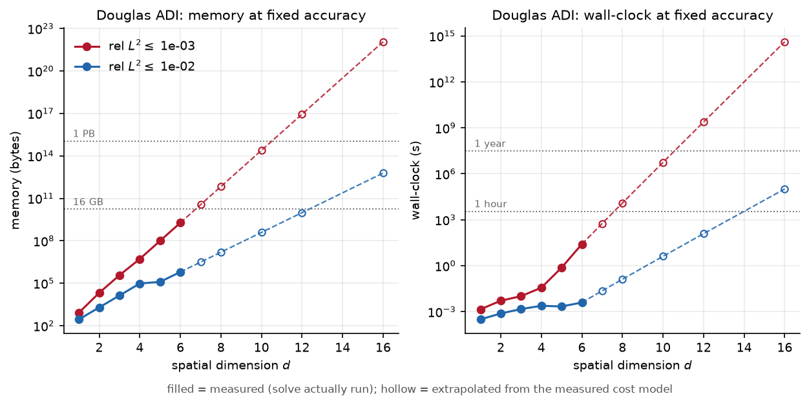</p>

Cost to reach a fixed relative $L^2$, with the grid found by prediction and then
actually run (the error column is what the returned grid measured, not the
target):

| target | $d$ | $N$ | unknowns | rel $L^2$ | wall | memory | |
|---|---|---|---|---|---|---|---|
| $10^{-3}$ | 3 | 22 | 9,261 | 8.98e-4 | 10 ms | 362 KB | measured |
| $10^{-3}$ | 4 | 20 | 130,321 | 9.80e-4 | 37 ms | 4.97 MB | measured |
| $10^{-3}$ | 5 | 20 | 2,476,099 | 9.01e-4 | 0.75 s | 94.5 MB | measured |
| $10^{-3}$ | 6 | 20 | 47,045,881 | 8.44e-4 | **25.6 s** | **1.75 GB** | measured |
| $10^{-3}$ | 8 | 20 | $1.7\times10^{10}$ | — | 205 min | 633 GB | *extrapolated* |
| $10^{-3}$ | 16 | 20 | $2.9\times10^{20}$ | — | $1.3\times10^{7}$ yr | 9.77 ZB | *extrapolated* |
| $10^{-2}$ | 6 | 6 | 15,625 | 9.33e-3 | 3.9 ms | 610 KB | measured |
| $10^{-2}$ | 16 | 6 | $1.5\times10^{11}$ | — | 28.4 h | 5.55 TB | *extrapolated* |

**$d \geq 7$ is extrapolated, not run**, and the projection scales the largest
*measured* cell by the scheme's own $d\,(N-1)^d$ complexity rather than
evaluating a fitted model — so it reproduces its anchor exactly. The full model
`seconds = nt·d·(c_py·(N-1) + tau·(N-1)^d)` is fitted and reported next to it as
the evidence that this is the law the measurements follow.

**Three things this measured that the cost formula does not tell you.**

**The wall is set by the accuracy, not by $d$ alone.** At $10^{-2}$ the $d=16$
mesh needs 5.55 TB and about a day — large, but not obviously impossible. Ask
for one more digit and the same $d=16$ solve needs $9.8$ ZB and $10^7$ years.
Tightening the target moves $N$ from 6 to 20, and $(20/6)^{16}$ is $3\times10^8$.
In high dimension the curse is charged per digit.

**Six dimensions ran.** The plan for this section was $d=1,2,3$ measured and
everything above extrapolated. $d=6$ at $10^{-3}$ turned out to fit in 1.75 GB
and 26 seconds, because only the current time level is stored (memory is
independent of $n_t$, unlike §6's solver, which returns the whole space-time
field). A measured point beats an extrapolated one, so the sweep goes to where
the machine actually stops.

**The accuracy a given grid reaches does not degrade with $d$** — which is the
premise the whole extrapolation rests on, so it is measured rather than assumed.
At a fixed $N=16$ the relative $L^2$ reads 1.61e-3, 1.90e-3, 1.70e-3, 1.53e-3,
1.41e-3, 1.32e-3 for $d=1\ldots6$: a $1.2\times$ band that slightly *improves*
with $d$. The reason is the $\alpha_d = \alpha_1/d$ scaling `highd_heat` chose
for a different purpose — the leading truncation error sums $d$ per-axis terms
and is multiplied by a diffusivity falling as $1/d$, so the two cancel.

Two smaller measurements that changed how the numbers above were taken:

- **The time step is not the binding cost, and the error is not monotone in it.**
  At fixed $N$, refining $n_t$ cuts the error at second order, *undershoots* the
  space-limited plateau, and comes back up to it: at $d=2$, $N=128$ the plateau
  is 3.16e-5 and the minimum is 1.69e-5 at $n_t=16$. The two truncation errors
  have opposite signs — the discrete Laplacian's eigenvalue underestimates
  $\alpha k^2\pi^2$ so space decays too slowly, while $(1-z/2)/(1+z/2)$ falls
  below $e^{-z}$ so time decays too fast — and at one $n_t$ they cancel. Tuning
  $n_t$ to that minimum would be reporting a cancellation belonging to this
  problem and this grid, so the operating point is $n_t = N/2$, taken from the
  plateau. It still collects a residual credit, largest at $d=1$ ($0.70\times$
  the plateau) and negligible by $d=4$ ($0.996\times$), and that is stated rather
  than absorbed.
- **A single "seconds per node-step" constant spans $1844\times$ across these
  cells** and would have been a fiction. Each line sweep is a Python loop over
  the $N-1$ nodes of an axis doing $O((N-1)^{d-1})$ of array work per iteration,
  so a small-$d$ solve measures the interpreter rather than the arithmetic. The
  two-term model above fits every cell to 59% and the four array-dominated cells
  to 26%; the projection sidesteps the question by anchoring on a measurement.

Memory here is *counted in the source* (five $(N-1)^d$ float64 arrays, asserted
in the tests) and not read off a process meter, with `tracemalloc` reported
beside it as a check. That follows `gp-from-scratch`, whose Day 7 found peak RSS
spreading 42% across five runs on one idle machine while every requested-bytes
figure was bit-identical.

The other half — the PINN on the same problem across the same dimensions — is
§11. It does not go the way this section's framing anticipates: at a fixed
budget the network's accuracy collapses with $d$ well before the mesh's cost
does, so the two curves still have to be put on one axis at *equal accuracy*
before anything can be called a crossover.

### 11. The PINN in $d$ dimensions, at one fixed budget (`experiments/highd_pinn.py`)

§10 measured the mesh side and left the comparison one-sided. This is the other
half: the same $d$-dimensional heat problem, the same closed-form solution, one
architecture and one budget at every $d$ — width 128, depth 4, Adam at 1e-3 for
5000 steps, 4000 interior and 400+400 boundary/initial collocation points,
nothing tuned per dimension. Three seeds per cell, because a single seed does
not survive this repo's own evidence (§9 found a 6.8× seed spread on this
problem class; §1's committed history oscillates 14× over its last 1500 steps).

**The cost side is exactly as advertised. The accuracy side is not.**

| $d$ | params | mean rel $L^2$ | sd (3 seeds) | max/min | MC error | ms/step (median of 3) |
|---|---|---|---|---|---|---|
| 1 | 50,049 | **8.18e-4** | 2.1e-4 | 1.68× | 0.19% | 27.2 |
| 2 | 50,177 | 3.93e-3 | 5.2e-5 | 1.03× | 0.21% | 40.2 |
| 4 | 50,433 | 3.86e-2 | 4.1e-3 | 1.23× | 0.13% | 65.8 |
| 8 | 50,945 | 7.64e-1 | 2.7e-2 | 1.07× | 0.19% | 115.8 |
| 16 | 51,969 | **1.041** | 2.9e-2 | 1.06× | 1.12% | 223.8 |

<p align="center">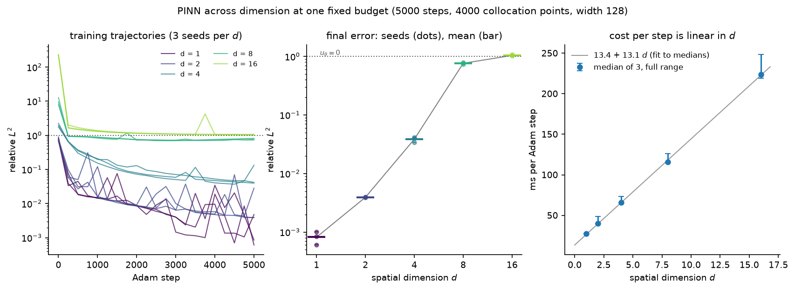</p>

**A network that outputs zero everywhere scores exactly 1.0** — that is what
normalizing by $\|u\|_{L^2}$ means, and `tests/test_highd_heat.py` asserts it.
So at $d=16$ this budget is *worse than saying nothing*, and at $d=8$ it is only
24% better. The error rises 1270× from $d=1$ to $d=16$ while the cost per step
rises 8.2×. Whatever the high-dimensional argument for PINNs is, **this
measurement does not support it**, and it is the direction §10's framing
anticipated would reverse.

The seed spread is not the explanation: at every $d$ the spread across seeds is
1.03–1.68× against effects of 5–20× per doubling in $d$, and the Monte Carlo
error in the metric itself is 0.2% everywhere except $d=16$, where it is 1.1%.
Both are reported per cell in `logs/highd_pinn_sweep.csv`.

**The training loss does not see any of this, and normalizing it is what shows
why.** The raw losses are not comparable across $d$ — the solution's rms falls
like $2^{-d/2}$, from 0.591 at $d=1$ to 0.00346 at $d=16$, so a small absolute
loss at high $d$ is cheap. Divided by the target's own energy (`loss_scales`
derives the two, and the table is printed by `highd_pinn.report`):

| $d$ | 1 | 2 | 4 | 8 | 16 |
|---|---|---|---|---|---|
| relative IC error | 0.0026 | 0.0123 | 0.0424 | 0.262 | **1.131** |
| relative residual | 0.0091 | 0.0208 | 0.0875 | 0.368 | 0.334 |

At $d=16$ the initial condition is fit *worse than by zero* while the raw
`loss_ic` reads 2.4e-5, the second-smallest number in the whole sweep. The
absolute training loss at $d=16$ (2.6e-5) is lower than at $d=2$, $4$ and $8$;
read without the normalization it says the run went well.

**And the optimizer is not simply out of budget at $d=8$.** Over the last
quarter of training the loss still falls 2.0×, while the relative $L^2$ moves
0.94× — it has stopped tracking the loss entirely. At $d=1$ the two move
together (2.6× and 2.6×). The natural suspect is in this repo's own metric
study: a uniform collocation sample almost never lands where the solution's
norm lives, since the top 1% of points carry 4.4% of $\|u\|^2$ at $d=1$ but
47% at $d=8$ and 89% at $d=16$. The residual is being minimized where the
samples are. That is a hypothesis consistent with these numbers, not a result —
testing it means changing the sampling, which is a separate experiment.

**Selecting the iterate by training loss is worth up to 3×, and it is free.**
`highd_heat.train` returns the lowest-training-loss iterate rather than the last
one (the loss contains no ground truth, so nothing about the exact solution
enters the choice). Mean relative $L^2$ of the final iterate against the
selected one: 2.5× worse at $d=1$, 3.1× at $d=2$, 1.9× at $d=4$, and 1.01× at
$d=8$ — the tail oscillation §1's own log shows is real and costs a factor of a
few, and it disappears exactly where the run has nothing left to oscillate about.

**Cost per step is linear in $d$, and the wall clock is not reproducible.**
Three passes on one idle machine spanned 219–248 ms/step at $d=16$; an earlier
set of three spanned 213–284, moving the fitted slope from 12.4 to 17.0 ms and
the intercept from 2.2 to 15.4. So the median of three is what the table and
the fit report (13.4 + 13.1$d$ ms/step), and the load-bearing claim is the
*shape*, which is pinned structurally rather than by a clock:
`tests/test_highd_pinn.py` counts the reverse-mode passes in one residual
evaluation and asserts exactly $d+2$ — one for $u_t$, one shared first gradient,
one per spatial axis — against $2d+1$ for the naive form. Parameters grow only
through the input layer, 3.8% from $d=1$ to $d=16$.

Two things this section is **not**. It is not a claim about what a PINN can do
at $d=16$ with a budget chosen for $d=16$: this is one budget, held fixed on
purpose so the sweep measures $d$ and not a tuner, and finding the budget each
$d$ needs is a different experiment. And it is not yet the comparison §10 asked
for — that needs cost to a *fixed accuracy* on both sides, which is §12.

### 12. The crossover, at equal accuracy (`experiments/highd_crossover.py`)

§10 measured the mesh's cost in $d$ and §11 measured the PINN's accuracy in $d$,
and neither is a comparison. A wall-clock number means nothing beside another
one unless both methods reached the same accuracy — and they do not, so the only
fair axis is **cost to reach a fixed relative $L^2$**, with the accuracy each
method actually hit reported next to the time it took.

Three targets rather than one, because the crossover dimension is not a property
of the two methods; it is a property of the two methods *and the accuracy asked
of them*. §10 already found why: refining the mesh moves $N$, the cost moves as
$N^d$, and one more digit is a factor $(N'/N)^d$. A single target would hide
that.

<p align="center">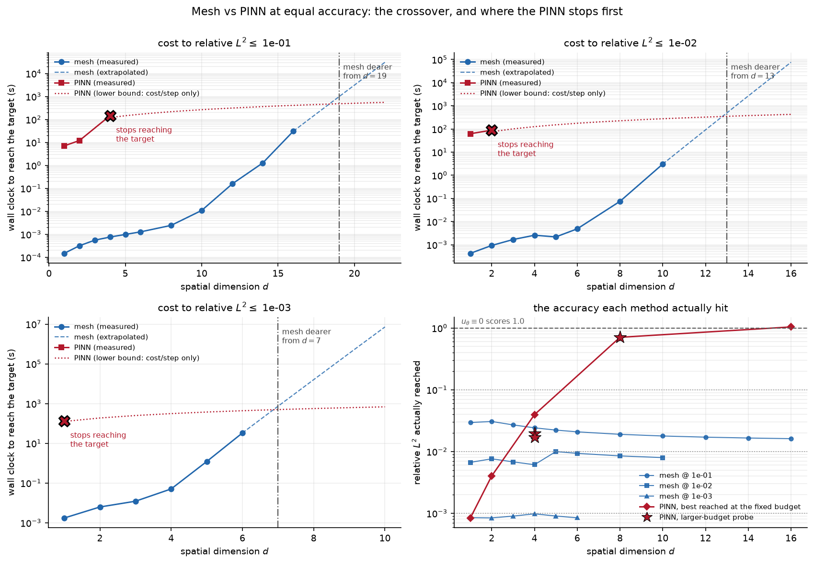</p>

**The loose target settles it, because there the mesh is measured all the way.**
At $10^{-1}$ the grid that reaches the target is $N=4$, so a solve is $3^d$
unknowns — and $3^{16}$ is 43 million, which fits in 1.7 GB. So the mesh side of
this row is *measured at every $d$ out to 16*, with no extrapolation anywhere:

| $d$ | 1 | 2 | 4 | 8 | 12 | 16 |
|---|---|---|---|---|---|---|
| mesh, s | 0.00015 | 0.00032 | 0.00076 | 0.0024 | 0.156 | **30.7** |
| mesh rel $L^2$ | 2.9e-2 | 3.1e-2 | 2.4e-2 | 1.9e-2 | 1.7e-2 | 1.6e-2 |
| PINN, s | 7.1 | 12.1 | **146** | never | — | never |
| PINN best rel $L^2$ | 8.4e-4 | 4.0e-3 | 4.0e-2 | 7.1e-1 | — | 1.04 |

At $d=4$ — the last dimension where the network reaches $10^{-1}$ at all — it
costs 146 s against the mesh's 0.00076 s **at the same $d$ and the same
accuracy**, a factor of $1.9\times10^{5}$, in the setting chosen to favour it.

**Where the two curves would meet, and where the PINN stops first.** The PINN's
cost is extrapolated on the most generous assumption available: that it needs no
more optimizer *steps* at high $d$ than the most it needed at any $d$ where it
worked, at the measured $13.4 + 13.1d$ ms/step. Both halves are generous — the
step count it actually needed grows $250 \to 1833$ over the range where it works
— so the crossing below is a **lower bound**, and
`tests/test_highd_crossover.py` checks that direction rather than asserting it
(a cheaper assumed PINN can only move the crossing earlier).

| target | mesh becomes dearer from | PINN last reached it at | headroom |
|---|---|---|---|
| $10^{-1}$ | $d \geq 19$ | $d = 4$ | **15 dimensions** |
| $10^{-2}$ | $d \geq 13$ | $d = 2$ | 11 |
| $10^{-3}$ | $d \geq 7$ | $d = 1$ | 6 |

**The crossover is real and it moves in as the target tightens** — 19, 13, 7 —
which is §10's "charged per digit" seen from the other side. But the PINN's
terminus moves in *faster* (4, 2, 1), so the gap never closes. **At no target
tested does the crossover happen anywhere the network can still deliver the
accuracy.** That is the week's thesis losing on its own chosen ground, and it is
the answer to the question §10 and §11 were both pointing at.

**A larger budget does not rescue the cell that would matter most.** "It did not
get there in 5000 steps" is a statement about a budget, so $d=4$ was re-run at
4× — 20,000 steps, 1531 s. It got from 4.18e-2 to 1.98e-2 and stopped: still
2.0× short of $10^{-2}$. No budget-to-target is quoted from it, and the reason
is worth more than the number would have been. Fitting $\text{err}\sim
\text{steps}^{-p}$ over four windows gives $p = -0.46, -0.35, -1.05, -0.53$ —
the trailing half of the trajectory spans 7.2×, so $p$ is not identified and any
extrapolation would be reporting the window rather than the method.
`probe_trend` prints all four windows for exactly that reason, with a clean
power law as its control.

**Two things cut against the mesh here, and both are stated rather than
absorbed.** Its grid is an even integer, so it *overshoots*: at $10^{-1}$ it
lands between 1.6e-2 and 3.1e-2, i.e. it is being charged for 2–6× more accuracy
than was asked. And these cells were re-measured in one sitting on a busier
machine than §10's — the 12 shared cells reproduce their grid and their relative
$L^2$ **identically, to the last digit**, while the wall clock runs 1.00–1.63×
higher (median 1.22×). Both push the same way: the mesh's seconds above are if
anything inflated relative to the PINN's, which is the conservative direction
for the conclusion.

**Not run, and so not claimed**: the $d=8$ probe at $10^{-1}$ and a second seed
at $d=4$. Both were started and starved by external load on this machine (93
CPU-seconds in 25 wall-minutes), so the $d=8$ terminus in the table rests on the
5000-step budget alone, and the $d=4$ probe is one seed against a measured 1.23×
seed spread. `probe_sweep` resumes from committed cells, so finishing them costs
only their own runtime.

## Reproduce

Every figure, from a clean clone, without training anything:

```bash
python -m venv .venv && source .venv/bin/activate
pip install torch --index-url https://download.pytorch.org/whl/cpu
pip install -r requirements.txt && pip install -e .
./reproduce.sh                  # tests, then all 15 figures: ~1 min
```

Training this repo end to end is about three hours of CPU, so the artifacts
ship with it: CSV logs in `logs/`, trained weights in `checkpoints/`. The split
matters — a figure of a *curve* can be rebuilt from a log, but a figure of a
*field* (the error heatmaps, the Burgers slices, the k=32 profile) is a picture
of the trained network, and only the weights reproduce that. Each experiment
takes `--figures` to replay its own figures alone.

`requirements.txt` pins the exact versions the committed artifacts were
produced with (Python 3.12.13, torch 2.13.0); `pyproject.toml` keeps lower
bounds, which is what CI installs on 3.10 and 3.12. Training is seeded and
replays on the same torch build — the heat run reproduces its committed loss
history to every digit the CSV stores — but torch guarantees no bitwise
determinism across versions or hardware, which is why the artifacts are
committed rather than regenerated on demand.

To actually retrain:

```bash
pytest -q                       # 222 tests, ~1 min
cd experiments
python heat.py                  # ~25 min (default solve + both sweeps)
python heat.py --tail           # ~8 min  (final-iterate spread of the width sweep)
python highd_heat.py --verify   # ~3 min  (d=1 pin of the d-dimensional code)
python highd_heat.py --metric   # ~2 min  (Monte Carlo metric precision vs d)
python burgers.py               # ~30 min (Cole-Hopf truth + PINN train)
python spectral_bias.py         # ~2 h   (12 PINN runs + regression + 3x controls)
python optimizer_study.py       # ~2.5 min (Adam vs L-BFGS vs hybrid)
python adaptive_collocation.py  # ~12 min (RAD/RAR: 3-arm collocation study)
python crank_nicolson.py        # <1 s   (classical FD baseline vs the PINN)
python highd_mesh.py --order    # ~6 s   (ADI convergence order; error vs d at fixed N)
python highd_mesh.py --steps    # ~9 s   (how many time steps a grid actually needs)
python highd_mesh.py --sweep    # ~85 s  (cost to fixed accuracy vs d, through d=6)
python highd_pinn.py --sweep    # ~2 h   (PINN at d = 1..16, 3 seeds, + cost per step)
python hard_bc.py               # ~14 min (hard-constraint ansatz vs soft penalty)
python inverse.py               # ~40 min (inverse problem: 3 sweeps, 14 solves)
python loss_weighting.py        # ~50 min (loss weights: 5 measurements, 60 solves)
```

Every script takes `--quick` for a fast smoke run, and `--figures` to skip
training entirely and redraw from the committed artifacts. Figures land in
`figures/`, numbers in `logs/`, weights in `checkpoints/`, all committed. Seeds
are fixed; runtimes are single-core CPU.

`tests/test_reproduce_figures.py` asserts that every figure in `figures/` has a
replay path, that every log and checkpoint the replay reads is committed, and
that each checkpoint still loads into the model its experiment builds today —
so the reproduction path cannot quietly rot.

## Design notes

- **Tests assert the math, not the plumbing.** The derivative helpers are the
  foundation everything else rests on, so they are checked against central
  finite differences *and* hand-derived closed forms, in float64. Each ground
  truth is independently verified: the heat solution satisfies the PDE by FD
  and decays each mode at the right rate (isolated by projection); the
  Cole-Hopf solution satisfies the PDE by FD away from the shock — and the FD
  residual blows up *inside* the shock band, which is documented rather than
  papered over.
- **Ground truth is never a grid solver.** Exact Fourier series and Cole-Hopf
  quadrature. A discretized reference would confound the PINN's error with the
  reference's own.
- **Comparisons don't move two things at once.** `FourierMLP` wraps the plain
  `MLP` rather than modifying it, so the baseline in §3 is bit-for-bit the
  network from §1, and $\sigma$ is fixed once across the whole sweep.
- **The negative results are the point.** A repo where every number is good is
  a repo that stopped measuring.

## Limitations / next

- **On these problems, classical solvers win — decisively.** Measured directly
  in §6: a Crank-Nicolson finite-difference solver on a coarse 20×20 grid beats
  the PINN's accuracy at ~$4\times10^{5}$ less wall-clock, and refines at a
  guaranteed second order while the PINN plateaus. The 1D heat equation is also
  solved to machine precision by a spectral method (it *is* the Fourier series
  of §1); the Cole-Hopf quadrature beats the ~30 minute PINN train on speed and
  accuracy by orders of magnitude. For
  low-dimensional, smooth, well-posed forward problems on regular domains,
  finite differences / finite elements / spectral methods win on speed,
  accuracy, and convergence *guarantees* (the PINN offers a nonconvex loss and
  no error order). **This repo is a study of the method's mechanics and
  failure modes, not an argument that PINNs should solve these PDEs.**
- **Where PINNs actually earn their place**: the inverse problem is measured in
  §8 — a coefficient recovered from 200 noisy point samples by adding one data
  term and one `nn.Parameter`, with no boundary data and no adjoint solver to
  hand-derive. **High dimension is now measured on both sides at equal accuracy,
  and it does not favour the PINN.** §10 runs an ADI mesh out to $d=6$ at
  $10^{-3}$ and shows the wall above it; §11 runs the network at
  $d = 1, 2, 4, 8, 16$ at one fixed budget and finds the relative $L^2$ rising
  1270× over that range, past 1.0 — the score of a network that outputs zero —
  by $d=16$; §12 puts the two on one axis. The crossover **does** exist and its
  dimension is computable ($d \geq 19$, 13, 7 as the target tightens through
  $10^{-1}$, $10^{-2}$, $10^{-3}$), but the PINN stops reaching those targets at
  $d = 4$, 2 and 1 — so it fails 6 to 15 dimensions before its own cost
  advantage would have arrived. Cost per step is linear in $d$ as promised;
  accuracy is what fails, so **nothing in this repo shows a PINN winning
  anywhere.** **Irregular geometry** remains undemonstrated entirely, and is now
  the strongest remaining candidate for a setting where the mesh's cost is the
  binding constraint rather than the network's accuracy.
- **Every PINN result except §11 is 1D + time**, and §11 is one budget rather
  than a search: the same architecture, step count and collocation count run at
  every $d$, on purpose, so that the sweep measures dimension and not a tuner.
  Whether a budget chosen *for* $d=8$ or $d=16$ — more collocation points,
  importance-sampled ones, a wider net, longer training — recovers the accuracy
  is not tested here, and §11's own last-quarter numbers ($d=8$: loss still
  falling 2.0×, error flat at 0.94×) say the answer is not simply "train
  longer". §12 tested the nearest version of "train longer" that could be
  afforded — $d=4$ at 4× the steps — and it moved the error 2.1× while leaving
  the cell 2.0× short, so the budget question is narrowed but not closed. What a
  *differently shaped* budget buys (importance-sampled collocation above all,
  since this repo's own metric study says the top 1% of uniform points carry 89%
  of the norm at $d=16$) is still untested. (L-BFGS is studied in §4,
  residual-adaptive collocation in §5, and hard boundary conditions in §7 — all
  three were on this list. Soft penalties remain the default because the hard
  ansatz must be hand-derived per problem, §7.)

## References

Raissi, Perdikaris & Karniadakis (2019) (the PINN formulation; the Burgers
benchmark); Cole (1951) and Hopf (1950) (the Cole-Hopf linearization);
Rahaman et al. (2019) (spectral bias); Jacot, Gabriel & Hongler (2018) (the
NTK behind §3, derived from scratch in gp-from-scratch); Tancik et al. (2020)
(random Fourier features); Wang, Wang & Perdikaris (2021) (the
eigenvalue-flattening argument for PINNs specifically); Sitzmann et al. (2020)
(SIREN); Lu et al. (2021, DeepXDE) and Wu et al. (2023) (residual-adaptive
refinement / distribution — RAR and RAD in §5). Full list with roles in
[`theory/derivations.md`](theory/derivations.md).

## Part of a from-scratch series

Same bar in each: the core written out by hand, every non-obvious claim checked
against a closed form or an independent oracle, limitations stated rather than
buried.

| Repo | Built from scratch |
| --- | --- |
| **pinn-from-scratch** *(this repo)* | Physics-informed networks: exact autograd PDE residuals against closed-form solutions |
| [mcmc-from-scratch](https://github.com/porth-bot/mcmc-from-scratch) | Metropolis-Hastings, Gibbs, HMC, MALA, NUTS, parallel tempering — validated against exact posteriors |
| [gp-from-scratch](https://github.com/porth-bot/gp-from-scratch) | GP regression, kernels with hand-derived gradients, ML-II, and the NTK/NNGP wide-network correspondence |
| [grokking-transformer](https://github.com/porth-bot/grokking-transformer) | A transformer that groks modular arithmetic, and the Fourier circuit it learns |
| [diffusion-from-scratch](https://github.com/porth-bot/diffusion-from-scratch) | Score matching, reverse-time samplers, and the probability-flow ODE — against exact scores at every noise level |

The load-bearing link is to gp-from-scratch: §3's spectral bias is not a
metaphor about the NTK but an application of it, and the
$(1-\eta\lambda_i)^s$ contraction it rests on is derived from scratch there in
§6–7 (cross-linked from [`theory/derivations.md`](theory/derivations.md) §4).
grokking-transformer is the same frequency-domain lens pointed at a different
question — what a trained network represents, read off the trajectory rather
than the endpoint, which is exactly the distinction §3 needed the 3× budget
controls to make.

## Provenance

This is a from-scratch study resource for learning how PINNs work.
Every derivation is written out in
[`theory/derivations.md`](theory/derivations.md) and every non-obvious claim is
tested against a closed-form or independently computed ground truth rather than
taken on faith.

*Suggested GitHub topics:* `physics-informed-neural-networks` `pinn` `pde`
`scientific-ml` `pytorch` `from-scratch`

## License

MIT — see [LICENSE](LICENSE).
