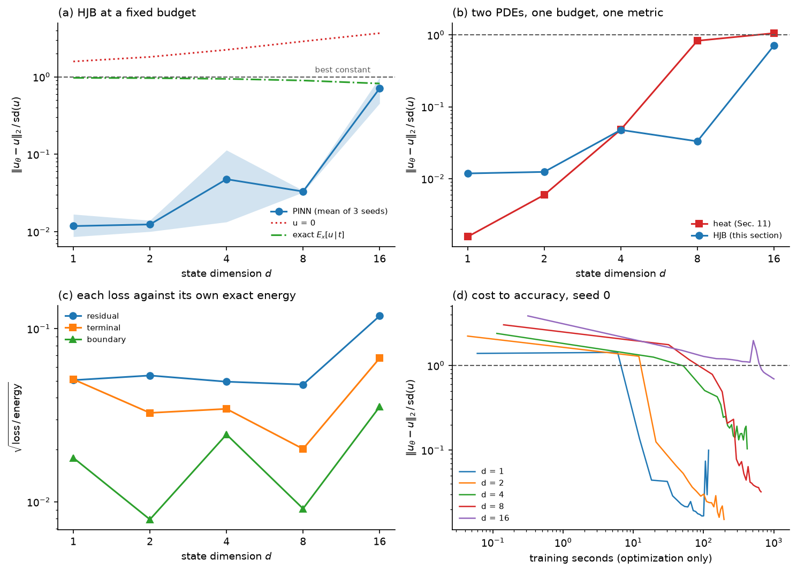
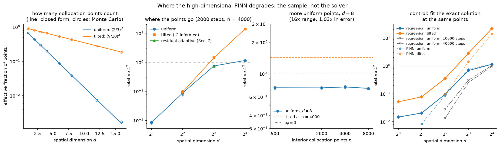
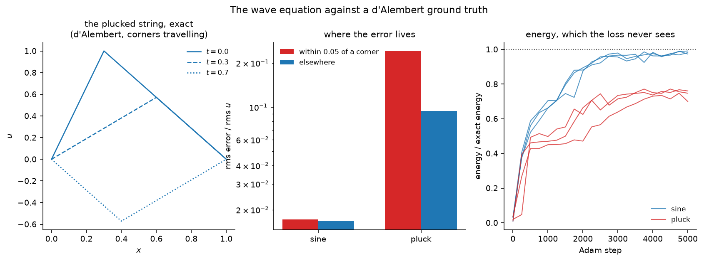
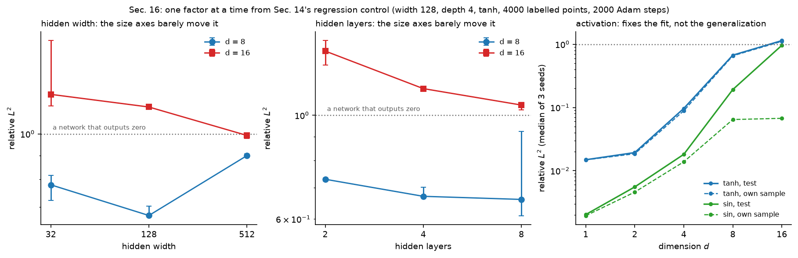
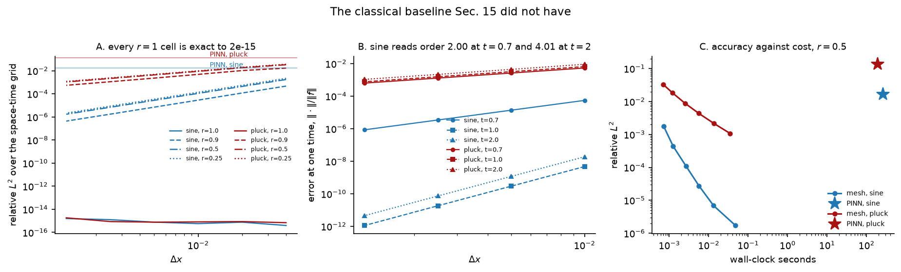

# pinn-from-scratch


Physics-informed neural networks built from the derivatives up, in PyTorch.
The network is a plain MLP; the PDE residual is formed from **exact autograd
derivatives** of that network — `u_t`, `u_x`, `u_xx` written out by hand in
[`pinn/derivatives.py`](pinn/derivatives.py) — and training minimizes a
weighted sum of the residual and the initial/boundary conditions. Every
problem here comes with a **closed-form or independently computed ground
truth**, so the PINN's error is always *measured against truth*, never
asserted.


*Viscous Burgers' equation, $u_t + u u_x = \nu u_{xx}$ with $\nu = 0.01/\pi$
and $u_0 = -\sin(\pi x)$ — the canonical PINN benchmark, whose smooth initial
condition steepens into a shock at $x=0$. Ground truth (left) is **not** a
grid solver: it is the exact Cole-Hopf transform evaluated by Gauss-Hermite
quadrature. The PINN (middle) reaches **1.17e-2** relative L2, and the error
(right) is not spread over the domain — it is a thin bright line exactly on
the shock.*

## What this repo measured

Two halves, reaching conclusions that look opposite until you notice they are
about different things. Both were run because either one alone would be
misleading.

**§§1–9, one space dimension plus time: the mechanics, and where they break.**
Exact autograd derivatives scored against Fourier-series and Cole-Hopf ground
truths; spectral bias derived through the NTK and then measured; L-BFGS;
residual-adaptive collocation; hard boundary conditions; an inverse problem; and
what the loss weights actually decide. Here the classical solver wins and §6
measures by how much — Crank-Nicolson on a 20×20 grid beats the PINN's accuracy
at about $4\times10^{5}$ times less wall clock. Nothing in this half argues that
a PINN should be solving these PDEs.

**§§10–14, up to sixteen dimensions: the case usually made *for* PINNs, put on a
fair axis.** The mesh's cost is exponential in $d$ and the network's is linear,
so a crossover has to exist somewhere. It does, and §12 computes it: the mesh
becomes the dearer method at $d \geq 19$, 13 and 7 for accuracy targets of
$10^{-1}$, $10^{-2}$ and $10^{-3}$. **The PINN stops reaching those targets at
$d = 4$, 2 and 1** — six to fifteen dimensions before its own cost advantage
would have arrived, and both ends move in as the target tightens, the PINN's
faster. At one fixed budget its relative $L^2$ rises **1270×** across
$d = 1 \to 16$, ending at 1.041, where a network that outputs zero everywhere
scores exactly 1.0. So no target tested has a crossover anywhere the network can
still deliver the accuracy, and nothing here shows a PINN winning a cost
comparison.

**Then the control that reframes all of it.** Replace the physics-informed loss
with supervised regression onto the *exact solution* — same architecture, same
points, same budget — and the gap closes to 12% at $d=8$ and 2% at $d=16$; at
$d=16$ the regression cannot fit even the 4000 labels it was handed. The
collapse is therefore mostly **not** a fact about PINNs. It is a width-128 tanh
network failing to approximate a $2^{-d/2}$-scale concentrated target, and the
residual formulation inherits that rather than causing it. §14 named the
architecture as the binding untested variable, and §16 tests it: width and
depth do almost nothing, but a sine activation fits the $d=16$ labels to 0.067
where tanh cannot fit them at all — and still scores 0.960 on the cube. The
architecture was binding on the fit and is not binding on the generalization.

Two PDEs rather than one: §13 repeats the whole sweep on a linear-quadratic HJB
equation (nonlinear in $\nabla u$, backward in time, inhomogeneous boundary data,
and a target whose spread does *not* shrink with $d$), at the identical budget.
The collapse reappears — **delayed by a factor of two in $d$, not removed** — so
"PINNs fail above some dimension" is too coarse a statement to be worth making:
the dimension is a property of the problem, and it moved 2× between the only two
problems tested.

### The sections

| | | |
|---|---|---|
| [1](#1-the-heat-equation-vs-its-exact-fourier-series-experimentsheatpy) | heat equation vs its exact Fourier series | the baseline solve, and a width sweep its own final iterates do not establish |
| [2](#2-burgers-equation-via-cole-hopf-experimentsburgerspy) | Burgers via Cole-Hopf | the canonical benchmark, against quadrature rather than a grid |
| [3](#3-spectral-bias-the-failure-mode-measured-experimentsspectral_biaspy) | spectral bias | derived from the NTK, measured, and then fixed with Fourier features |
| [4](#4-optimizer-our-adam-vs-torch-l-bfgs-experimentsoptimizer_studypy) | Adam vs L-BFGS | our Adam against torch's L-BFGS, and the hybrid |
| [5](#5-residual-adaptive-collocation-a-failure-mode-and-its-fix-experimentsadaptive_collocationpy) | residual-adaptive collocation | RAD/RAR on the Burgers shock, three arms |
| [6](#6-the-classical-baseline-crank-nicolson-finite-differences-experimentscrank_nicolsonpy) | the classical baseline | finite differences, and the $4\times10^{5}$ |
| [7](#7-hard-boundaryinitial-conditions-a-trial-function-ansatz-experimentshard_bcpy) | hard boundary conditions | a trial-function ansatz against the soft penalty |
| [8](#8-the-inverse-problem-recover-the-coefficient-from-noisy-data-experimentsinversepy) | the inverse problem | a coefficient recovered from noisy points, no adjoint |
| [9](#9-what-the-loss-weights-actually-decide-experimentsloss_weightingpy) | what the loss weights decide | 60 solves; the trivial-solution cliff is real and three decades away |
| [10](#10-the-mesh-in-d-dimensions-and-where-it-stops-experimentshighd_meshpy) | the mesh in $d$ dimensions | ADI out to $d=6$, and the wall above it |
| [11](#11-the-pinn-in-d-dimensions-at-one-fixed-budget-experimentshighd_pinnpy) | the PINN in $d$ dimensions | one budget at $d = 1,2,4,8,16$; the 1270× |
| [12](#12-the-crossover-at-equal-accuracy-experimentshighd_crossoverpy) | the crossover, at equal accuracy | three targets; where it is, and why the network never gets there |
| [13](#13-a-second-high-dimensional-pde-so-it-is-not-one-equation-experimentshighd_hjbpy) | a second high-$d$ PDE | linear-quadratic HJB at the same budget |
| [14](#14-where-it-degrades-anyway-and-which-part-degrades-experimentshighd_degradepy) | which part degrades | samplers, density, seeds, and the supervised control |
| [15](#15-the-wave-equation-a-dalembert-ground-truth-and-a-kink-experimentswavepy) | the wave equation | d'Alembert on the odd extension, a kink, and a conserved energy |

## What a PINN is, and why the derivatives are the whole story

A finite-difference or spectral solver stores $u$ on a grid and approximates
$u_{xx}$ by differencing neighbours. A PINN instead represents the solution as
a smooth function $u_\theta(x,t)$ — a neural network — and asks automatic
differentiation for its *exact* derivatives at arbitrary points. The PDE,
written as a residual $r(x,t) = 0$ (for the heat equation, $r = u_t - \alpha
u_{xx}$), becomes a loss:

$$\mathcal{L}(\theta) = w_r \overline{r(x_i,t_i)^2} \;+\; w_{ic}\, \overline{(u_\theta(x,0) - u_0)^2} \;+\; w_{bc}\, \overline{(u_\theta(\partial\Omega,t) - g)^2}.$$

Three consequences, each of which this repo tests rather than assumes:

- **There is no truncation error in the derivatives.** $u_{xx}$ is the true
  second derivative of the network, not an $O(h^2)$ stencil. The tests check
  the helpers against central differences *and* hand-derived closed forms on
  $u = \sin(ax)e^{-bt}$ — in float64, so the reference isn't float32 noise.
- **There is no grid**, so collocation points can be sampled anywhere, and the
  cost does not explode with dimension.
- **The minimization is nonconvex and the loss terms compete.** This is where
  PINNs actually fail, and §3 is a measured account of one such failure.

The activation is load-bearing: a ReLU network has $u_{xx} \equiv 0$ almost
everywhere and *cannot express a diffusion residual at all*. `tanh` is the
default for that reason, and there is a test asserting exactly this.

## Core modules

| module | what it does |
|---|---|
| [`pinn/model.py`](pinn/model.py) | `MLP` — tanh (default) or SIREN-style sine activations, Xavier / SIREN init, linear output head. `set_seed` for reproducibility. |
| [`pinn/derivatives.py`](pinn/derivatives.py) | `u_x`, `u_t`, `u_xx`, `u_tt`, `laplacian` via `torch.autograd.grad` with `create_graph=True` (so derivatives are themselves differentiable and can be composed into higher orders). The batch-diagonal-Jacobian trick is written out in the module docstring. |
| [`pinn/losses.py`](pinn/losses.py) | `residual_loss` (physics passed in as a callable), shared `data_loss` for IC/Dirichlet-BC, reproducible uniform collocation samplers (`interior_points`, `initial_points`, `boundary_points`), and `adaptive_interior_points` — residual-adaptive resampling (RAD; Wu et al. 2023) that pulls points toward large-residual regions like the Burgers shock (§5). Each takes an explicit `torch.Generator`. |
| [`pinn/features.py`](pinn/features.py) | `FourierFeatures` — a fixed, non-trainable random Fourier map $\gamma(v) = [\cos 2\pi Bv,\ \sin 2\pi Bv]$ with per-coordinate $\sigma$ — and `FourierMLP`, a wrapper, so the plain MLP stays bit-for-bit unchanged and the §3 comparison is honest. |

The derivations behind all of it — the PINN loss, the heat Fourier series,
Cole-Hopf start to finish, spectral bias via the NTK — are written out in
[`theory/derivations.md`](theory/derivations.md).

## Results

### 1. The heat equation vs its exact Fourier series (`experiments/heat.py`)

$u_t = \alpha u_{xx}$ on $[0,1]^2$, homogeneous Dirichlet BCs, initial
condition a sum of three sine modes. The modes $\sin(k\pi x)$ are exactly the
Laplacian's eigenfunctions under these BCs, so the heat semigroup just
multiplies mode $k$ by $e^{-\alpha(k\pi)^2 t}$ and

$$u(x,t) = \sum_k a_k \sin(k\pi x)\, e^{-\alpha (k\pi)^2 t}$$

is an **exact closed form, not a truncation** — the error is measurable
pointwise, everywhere. The three modes decay at rates $1:4:9$, so the high
mode is gone by mid-time while the fundamental lingers: a clean multi-scale
target.

The default network (width 128, 4k interior points, 5k Adam steps) reaches
**relative L2 = 3.6e-3**. The two convergence sweeps below hold the optimizer
budget at **3k steps** instead, so that a cell differs from its neighbours in
one thing only; that shorter budget is why the width-128 / 4k-point cell they
share reads 4.20e-3 rather than the headline 3.6e-3. It reads
$4.202991\times10^{-3}$ in *both* logs, to every digit — the same seeded run,
which is the cheapest available check that the two sweeps are comparable at
all. They say something more interesting than "it converges":

| interior points | 1k | 2k | 4k | 8k | 16k |
|---|---|---|---|---|---|
| rel L2 | 1.04e-2 | 4.17e-3 | 4.20e-3 | 3.91e-3 | 4.23e-3 |

| width | 32 | 64 | 128 | 256 |
|---|---|---|---|---|
| rel L2 | 2.33e-2 | 5.93e-3 | 4.20e-3 | **3.35e-3** |

**Collocation error saturates by ~2k points; width keeps paying.** Adding 8×
more collocation points past 2k does nothing (4.17e-3 → 4.23e-3, i.e. noise),
while width falls monotonically ~7× from 32 to 256. On a target this smooth,
the binding constraint is the network's *capacity to represent the solution*,
not the density at which the physics is sampled. That is a statement about
this problem, not about PINNs in general — a solution with fine structure
would sample-starve at 2k points.

**Every number above is a final iterate, and Adam has not settled.** The
committed `logs/heat_training.csv` reads 3.43e-3, 2.41e-2, 4.83e-2, 3.62e-3 at
steps 3500–5000, so even the headline 3.6e-3 is one sample of an oscillation
with a 14× band. `python experiments/heat.py --tail` re-runs each width cell and
evaluates it every 100 steps over the last 1000 (`logs/heat_tail.csv`). Every
cell reproduces its table entry exactly, and every cell has a band:

| width | 32 | 64 | 128 | 256 |
|---|---|---|---|---|
| reported (step 3000) | 2.33e-2 | 5.93e-3 | 4.20e-3 | 3.35e-3 |
| min–max over steps 2000–3000 | 7.7e-3 – 2.3e-2 | 5.9e-3 – 6.9e-2 | 4.2e-3 – 7.0e-3 | 3.3e-3 – 7.6e-2 |
| band | 3.0× | 11.7× | 1.7× | 22.8× |

**All four bands overlap their neighbours, so the 7× monotone fall in width is
not resolved by single final iterates.** The trend may well be real — three of
the four cells report at or near their own band minimum, and the widest network
reaches the lowest error seen anywhere — but this table does not establish it,
and settling it needs seed averaging that has not been run here. What the
measurement does settle is the *collocation* reading, in its favour: those
differences (4.17e-3 → 4.23e-3) are far inside this band, which is exactly what
"i.e. noise" claimed.

This is one seed's tail, not a seed study. The high-dimensional work in
`experiments/highd_heat.py` avoids the problem a different way — it returns the
iterate with the lowest *training* loss, which is selection on the objective
and uses no ground truth, so nothing about the exact solution leaks into the
choice.

<p align="center"></p>
<p align="center"></p>

### 2. Burgers' equation via Cole-Hopf (`experiments/burgers.py`)

$u_t + u u_x = \nu u_{xx}$, $\nu = 0.01/\pi$, $u_0 = -\sin(\pi x)$ on
$[-1,1]$ — the standard PINN benchmark (Raissi et al. 2019), because the
smooth IC self-steepens into a near-shock at $x=0$ that a naive method smears.

The ground truth is the honest part. The **Cole-Hopf transform** $u = -2\nu\,
\phi_x/\phi$ linearizes Burgers into the *heat* equation (derived start to
finish in [`theory/derivations.md`](theory/derivations.md) §3), so $\phi$ is
the heat-kernel integral against the transformed IC $\phi_0 = e^{-F/2\nu}$.
Substituting $x-y = \sqrt{4\nu t}\,z$ turns the Gaussian factor into exactly
the $e^{-z^2}$ Gauss-Hermite weight, so the truth is evaluated **grid-free by
quadrature** — no discretization to confound the comparison. One numerical
catch, handled rather than hidden: $\phi_0 \sim e^{1/(\nu\pi)} \approx
e^{100}$ overflows, so the quadrature runs in log-space with a per-point max
subtracted (it cancels in the ratio).

Trained at width 48, depth 6, 10k collocation points, 20k Adam steps (~29 min
CPU):

| | value |
|---|---|
| relative L2 vs Cole-Hopf | **1.17e-2** |
| squared error inside the shock band $\|x\|\le 0.1$ (10% of the area) | **94%** |
| mean $\|$error$\|$: in-band vs out-of-band | 7.7e-3 vs 9.2e-4 (**8.3×**) |

**The error is the shock, and nothing else.** 10% of the domain holds 94% of
the squared error. Away from $x=0$ the PINN is accurate to ~1e-3; the smooth
regions are essentially solved and the entire difficulty is the thin steep
band — which is exactly what the hero figure shows and exactly what the
method's critics predict.

<p align="center"></p>

*Profile slices at $t = 0.25, 0.5, 0.75, 1.0$: the PINN tracks the steepening
front. The test suite pins the ground truth independently — it satisfies the
PDE by finite differences away from the shock, is odd in $x$, holds $u = 0$ at
$x \in \{-1, 0, 1\}$ by symmetry, and its slope at the origin steepens from
$-1.0$ to below $-50$.*

### 3. Spectral bias: the failure mode, measured (`experiments/spectral_bias.py`)

Neural networks learn low frequencies first. For a PINN that is not cosmetic —
it decides which PDEs are reachable at all. The setup: the same heat equation,
but a **single-mode** IC $\sin(k\pi x)$, one PDE per $k \in \{1,2,4,8,16,32\}$.

The load-bearing design choice is $\alpha_k = \alpha_1/k^2$, which cancels the
eigenvalue exactly ($\alpha_k (k\pi)^2 = \alpha_1\pi^2$) so **every target has
identical O(1) amplitude and the same time envelope**. Without it the high-$k$
solution decays to ~0, a network predicting $u = 0$ would score a *small*
error, and the experiment would confound frequency with amplitude — measuring
nothing.

Steps to reach 10% relative L2 (final error in parens), seed 0, width 64,
depth 4, 8000 Adam steps:

| $k$ | 1 | 2 | 4 | 8 | 16 | 32 |
|---|---|---|---|---|---|---|
| plain MLP | **200** (.003) | **400** (.001) | 800 (.001) | 1800 (.002) | 7400 (.040) | **never** (.515) |
| + Fourier features | 4600 (.042) | 1400 (.014) | **400** (.006) | **400** (.004) | **600** (.018) | **4800** (.094) |

<p align="center"></p>

Three findings, one of which overturned this experiment's own premise:

**(1) Spectral bias is graded, not a cliff.** Time-to-fit roughly doubles per
octave and then blows up. It is cleanest in the no-PDE regression diagnostic,
where the network just fits the modes directly — at step 200 the learned
coefficients are $k_1 = 0.868$, $k_2 = 0.031$, $k_4 = -8\text{e-}4$, $k_8 =
-1\text{e-}4$, $k_{16} = -1\text{e-}5$, $k_{32} = -1\text{e-}6$: **an order of
magnitude per octave**, all converging to ~1.0 by step 10k. The ordering lives
in the *trajectory*, not the endpoint.

<p align="center"></p>

**(2) The planned "failed run" at $k=16$ is not a failure.** At 3× budget it
goes .040 → **.0097** — merely slow. So the sweep was extended to $k=32$,
where 3× budget only reaches .515 → **.262** (still 2.6× above target, and
2.8× worse than Fourier features at a *third* the budget). $k=16$ is slow;
$k=32$ is stuck; **only the 3×-budget check distinguishes them**. Calling
$k=16$ a failure would have been unsupported by the data, and that is why the
control is in the repo.

**(3) The mitigation is a trade in both directions.** Fourier features are not
free: at $k=1$ the Fourier model is **23× slower** (4600 vs 200 steps) and 16×
less accurate, because $\sigma_x = 5$ hands the network frequencies the target
does not contain and the optimizer chases them. Crossover is at $k=4$. And at
$k=32$ it strains at its own band edge ($\sigma$ covers ~5 cycles/unit; $k=32$
needs 16). Both edges follow from fixing $\sigma$ **once for the whole sweep,
deliberately** — a mitigation retuned per frequency is the answer smuggled
into the prior.

<p align="center"></p>

The explanation is the NTK's eigenspectrum: gradient descent contracts the
error along eigendirection $i$ like $(1 - \eta\lambda_i)^s$, and the tanh
network's kernel has eigenvalues that decay fast with frequency, so high-$k$
error decays at a rate indistinguishable from zero within budget. The Fourier
embedding flattens that spectrum. Derived in
[`theory/derivations.md`](theory/derivations.md) §4, cross-linked to the
from-scratch NTK derivation in
[gp-from-scratch](https://github.com/porth-bot/gp-from-scratch) §6–7.

**Two measurement traps, caught and fixed rather than tuned around.** An
FFT-based spectral measure credited the plain MLP with a fake 13%
high-frequency tail — the solution is a smooth ramp on $[0,1]$ and the FFT's
periodicity assumption leaks a $1/f^2$ tail into every bin. It was replaced by
a sine-basis projection with the endpoint ramp subtracted, in the problem's
own Dirichlet eigenbasis. And the FD ground-truth check's tolerance is now
*derived* as the $O(h^2)$ truncation floor $\alpha_1\pi^4k^2h^2/12$ rather
than guessed (it is $k$-independent under the $\alpha_k$ scaling).

### 4. Optimizer: our Adam vs torch L-BFGS (`experiments/optimizer_study.py`)

Every experiment above trains with Adam, but the PINN literature's default
recipe is **Adam then L-BFGS** — first-order to find a basin, then a
quasi-Newton method that uses curvature to polish the smooth, low-dimensional
PINN loss. This compares the two on the heat problem with everything but the
optimizer held fixed (same init, same fixed collocation, same loss). Cost is in
*loss-and-gradient evaluations* — Adam does one per step; L-BFGS calls its
closure several times per iteration for the strong-Wolfe line search, so a
per-step axis would flatter it. (Same honest per-evaluation accounting as the
ESS-per-gradient axis in the sibling [mcmc-from-scratch](https://github.com/porth-bot/mcmc-from-scratch).)

| regime | evals to converge | wall-clock | final rel L2 |
|---|---|---|---|
| Adam (8k steps) | 8 000 | 106 s | 2.42e-3 |
| L-BFGS (from init) | **673** | **9.8 s** | 2.27e-3 |
| hybrid (Adam 1k → L-BFGS) | 1 655 | 23 s | **2.25e-3** |

L-BFGS reaches the **same** ~2.3e-3 accuracy as Adam using ~12× fewer
evaluations and ~11× less wall-clock — curvature information is worth a lot on a
loss this smooth. Two honest caveats the numbers force: (1) on *this* easy,
convex-basin target pure L-BFGS from init is enough — the Adam warmup buys the
hybrid only a hair more accuracy and costs more than L-BFGS alone here; its real
value is on stiffer losses (the Burgers shock, high-$k$ spectral-bias runs)
where L-BFGS from a cold init can stall in a bad minimum. (2) Adam's error
*oscillates* late in training (visible as spikes below), while L-BFGS descends
monotonically then flattens — the line search rejects uphill steps.

<p align="center"></p>

### 5. Residual-adaptive collocation: a failure mode and its fix (`experiments/adaptive_collocation.py`)

Uniform collocation spreads its points evenly, but Burgers puts ~94% of its
error in the thin shock at $x=0$ (§2) — the region a uniform sample least
resolves. The obvious fix is to move points to where the residual is large
(`pinn.losses.adaptive_interior_points`, residual-density sampling; RAD, Wu et
al. 2023). The instructive result is that *how* you move them decides whether it
helps at all. Three arms, same 3000-point budget, sharing a bit-identical
uniform warmup so they branch from one state (rel L2 $\approx 0.21$ at step 5000):

| arm | rel L2 | shock-band \|err\| ($\lvert x\rvert\le0.1$) | off-shock \|err\| |
|---|---|---|---|
| **U** uniform (keep the set) | 2.10e-1 | 1.83e-1 | 1.89e-2 |
| **R** resample (replace the set by density) | **4.58e-1** | **5.54e-1** | 2.51e-2 |
| **A** RAR (add density points to the base) | **1.61e-1** | **1.24e-1** | 1.08e-2 |

<p align="center"></p>

**Replacing the whole set makes things worse, badly.** Burgers' residual is
near-singular at the shock (it carries $u_{xx}\sim\mathcal O(100)$), so a set
drawn $\propto\lvert r\rvert$ piles points onto the least-tractable region; the
loss is dominated by them, the smooth region loses coverage, and a model at rel
L2 $\approx0.21$ collapses to $0.46$ (its shock error *triples*) — measured
directly: within ~50 steps of the first resample the fit jumps from 0.03-class
to 0.86 on a longer clean run. **RAR fixes it by never removing the uniform
base**: keep the base, *add* density-drawn points (matched to the same total),
and the smooth region stays covered while the extra points sharpen the shock —
rel L2 falls to 0.16 (−23%) and shock-band error to 0.12 (−32%), with 25% of the
added points landing in $\lvert x\rvert\le0.1$ vs the ~10% a uniform draw gives.
The only difference between R and A is replace-vs-add.

Two honest notes. The absolute errors here are well above the flagship Burgers
run's 1.2e-2 (§2): this uses a smaller net and a shorter budget so three arms are
affordable, and the point is the *relative* effect of the collocation strategy,
which the shared warmup isolates. And RAD is not intrinsically bad — full-set
resampling on this near-singular target is; on smoother problems, or from a
sufficiently converged state, replacement is stable too. RAR is simply the safe
default here.

### 6. The classical baseline: Crank-Nicolson finite differences (`experiments/crank_nicolson.py`)

The limitations section says classical solvers win here decisively. This makes
it a number, not a claim. The *same* heat problem — same $\alpha$, same
three-mode IC, same Dirichlet BCs — is solved by a textbook second-order scheme:
Crank-Nicolson (trapezoidal-in-time central differences), one tridiagonal solve
per step via a from-scratch Thomas algorithm, unconditionally stable so the time
step is not tied to $dx^2$. Accuracy against the same exact solution, at four
grid resolutions, with wall-clock:

| method | grid | rel L2 | wall-clock | order |
|---|---|---|---|---|
| Crank-Nicolson | 20×20 | 1.74e-3 | **0.25 ms** | — |
| Crank-Nicolson | 40×40 | 4.37e-4 | 0.87 ms | 1.99 |
| Crank-Nicolson | 80×80 | 1.10e-4 | 3.3 ms | 2.00 |
| Crank-Nicolson | 160×160 | 2.75e-5 | 13 ms | 2.00 |
| **PINN** (Adam, §4) | — | 2.42e-3 | **106 s** | (none) |

<p align="center"></p>

**The coarsest 20×20 grid already beats the PINN's accuracy (1.7e-3 vs 2.4e-3)
at roughly $4\times10^{5}$ less wall-clock** (0.25 ms vs 106 s). And the two
curves go opposite ways: CN's error falls a clean factor of ~4 per refinement
(the measured convergence order is 2.00 — the FD scheme comes with a guarantee),
so it drives the error arbitrarily low for a few more milliseconds, while the
PINN's nonconvex loss plateaus near $10^{-3}$ and buys nothing from more compute.
This is the concrete backing for the first limitation below: for a smooth,
low-dimensional, well-posed forward problem, there is no contest. The PINN's case
is inverse/high-dimensional/mesh-free problems — none of which this is.

### 7. Hard boundary/initial conditions: a trial-function ansatz (`experiments/hard_bc.py`)

Every solve above enforces the IC and BCs the *soft* way — add
$w_{\text{ic}}\lVert u-g\rVert^2 + w_{\text{bc}}\lVert u\rVert^2$ to the residual
loss — so the constraints hold only approximately and the weights are a real
knob (the theory doc §1, §5 calls them out). The classical alternative (Lagaris,
Likas & Fotiadis 1998) is to build the constraints into the *function space*. For
this heat problem — $u(x,0)=g(x)$, $u(0,t)=u(1,t)=0$ — write

$$u_\theta(x,t) = g(x) + x\,(1-x)\,t\,N_\theta(x,t).$$

Both conditions are then exact for **any** network weights: at $t=0$ the factor
$t$ kills the correction so $u_\theta=g$; at $x\in\{0,1\}$ the factor $x(1-x)$
kills it so $u_\theta=g=0$ (the sine IC already vanishes at the walls). The IC/BC
loss terms disappear — the ansatz trains the residual alone, no weights. Same
architecture, same seed (bit-identical init), same collocation, same optimizer;
the only differences are the two the method is about.

| method | rel $L^2$ (best) | rel $L^2$ (final) | IC error | BC error | weights to tune |
|---|---|---|---|---|---|
| soft (residual + IC + BC) | 3.4e-3 | 3.6e-3 | 1.7e-2 | 1.7e-2 | 2 |
| **hard (ansatz, residual only)** | **2.4e-4** | 5.0e-3 | **0** | **6e-9** | **0** |

<p align="center"></p>

Two clean wins and one honest caveat. **(1)** The constraints are exact — IC to
zero, BC at the float32 floor — against the soft penalty's $1.7\times10^{-2}$,
and there is no weight to balance. **(2)** On accuracy the *trajectory* (panel a)
is the honest read: the ansatz reaches the soft run's lifetime-best error by
~step 700 (≈5× sooner) and bottoms out ~14× deeper ($2.4\times10^{-4}$ vs
$3.4\times10^{-3}$), because the IC/BC data no longer competes with the residual
in a weighted sum — the whole loss is the physics. **The caveat:** on this easy,
smooth problem both eventually plateau in the low-$10^{-3}$/$10^{-4}$ range and
both show late Adam oscillation, so the single *final-step* number is noisy
(hard's endpoint lands on an up-bounce and reads *worse* than soft's — which is
exactly why the honest column is *best*, not *final*). And the ansatz has a
cost the soft penalty does not: it must be hand-derived per problem (here it
needs the analytic $g$ and a boundary-vanishing envelope), whereas a penalty
term is added mechanically to any BC. Hard constraints remove a tuning knob and
guarantee exactness; they do not come free.

### 8. The inverse problem: recover the coefficient from noisy data (`experiments/inverse.py`)

Everything above is a *forward* problem, and §6 says plainly that a classical
solver wins those. This is the other direction, and it is the setting PINNs are
actually built for: the same heat problem, but $\alpha$ is **unknown** and the
only information is $N$ scattered noisy samples $y_i = u(x_i,t_i) + \varepsilon_i$.
No initial condition, no boundary condition — in an inverse problem the data
replaces them, and a finite-difference solver has nothing to march from.

The change to a PINN is one `nn.Parameter` and one extra entry in the
optimizer's list, because $\alpha$ already sits inside a term autograd is
differentiating:

$$L(\theta, \alpha) = \big\langle (u_t - \alpha u_{xx})^2 \big\rangle_{\text{collocation}} + w_d \big\langle (u_\theta - y)^2 \big\rangle_{\text{data}}.$$

We optimize $\log\alpha$, so $\alpha>0$ by construction and a step is a
*relative* change — necessary because the run starts deliberately wrong, at
$4\alpha$. The classical route to the same answer is an outer loop over full
forward solves, or a hand-derived adjoint.

Starting from $\alpha = 0.2$, with 200 samples at $\sigma = 0.02$ (2% of the
initial amplitude), the recovered value is $\hat\alpha = 0.0509$ against a true
0.05 — **1.9%** — and most of the trip happens in the first 1,000 of 6,000 Adam
steps ($0.2006 \to 0.0660 \to 0.0523$ at steps 0, 500, 1,000):

| $\sigma$ (at $N=200$) | 0 | 0.01 | 0.05 | 0.1 |
| --- | ---: | ---: | ---: | ---: |
| $\hat\alpha$ | 0.0498 | 0.0503 | 0.0526 | 0.0554 |
| error in $\alpha$ | 0.5% | 0.7% | 5.2% | **10.8%** |

| $N$ (at $\sigma=0.02$) | 25 | 50 | 100 | 200 | 400 |
| --- | ---: | ---: | ---: | ---: | ---: |
| error in $\alpha$ | 6.3% | 1.0% | 0.7% | 1.9% | 0.6% |

| window $t \leq t_{\max}$ | 0.1 | 0.25 | 0.5 | 1.0 |
| --- | ---: | ---: | ---: | ---: |
| error in $\alpha$ | 7.1% | 4.3% | 3.2% | 1.9% |

<p align="center"></p>

Three honest readings.

**Noise passes through roughly one-for-one.** Doubling $\sigma$ from 0.05 to 0.1
doubles the error, 5.2% → 10.8%, and the whole sweep is close to
$|\Delta\alpha|/\alpha \approx \sigma$ in units of the solution's amplitude. That
is the useful summary: this method does not amplify observation noise, and it
does not average it away either.

**Data volume saturates immediately.** 25 points is visibly short (6.3%);
from 50 on, every cell is between 0.6% and 1.9% and the ordering inside that
range is not meaningful — these are **single-seed** runs and 1–2% is the
run-to-run scatter of the Adam trajectory (visible directly in the trace's late
wobble, panel a). The claim is "tens of points suffice here", not "400 beats
200".

**Identifiability is about the time window, not the point count.** The heat
equation has an exact degeneracy, $u(x,t;\alpha) = u(x,\alpha t;1)$: scaling
$\alpha$ is rescaling time. So $\alpha$ is recoverable only from *absolute*
time labels, and only insofar as the observations span enough time for the decay
envelope $e^{-\alpha(k\pi)^2 t}$ to show. Shrink the window with the point count
and noise fixed and the error grows monotonically, 1.9% → 7.1%, with the field
error growing alongside it (0.9% → 3.1%). Same data volume, less information.

The control that says which term is doing the work: set $w_d = 0$ and the
objective is the residual alone, which *every* solution of the heat equation
satisfies for its own $\alpha$ — including $u \equiv 0$, which satisfies it for
all of them. The optimizer duly returns a flat field and leaves $\alpha$ at its
initialization — in the short configuration the test uses, $0.194$ against a
true 0.05 with 96% field error.
`tests/test_inverse.py` asserts exactly that, next to the identity that makes
recovery possible in the first place: on the true solution the residual measured
with a wrong diffusivity is exactly $(\alpha_{\text{true}} - \alpha)\,u_{xx}$.

One caveat worth stating: the recovered *field* here (0.9–4.5% relative $L^2$) is
worse than the forward solve's 0.36% in §1, and it should be — it is fitted to
200 noisy points with no boundary data instead of to an exactly known IC/BC.

### 9. What the loss weights actually decide (`experiments/loss_weighting.py`)

§7 calls $w_{\text{ic}}$ and $w_{\text{bc}}$ "a real knob" and the theory doc
§1 calls balancing them "a genuine difficulty", and every solve above has run at
$w_{\text{ic}}=w_{\text{bc}}=1$ without measuring what that choice costs. This
does: 60 solves, three seeds each, scored against the exact Fourier solution.

Two metrics, because one is not enough. Relative $L^2$ saturates near 1 for
*any* badly wrong field, so it cannot separate "fit the wrong shape" from
"learned nothing"; the amplitude ratio
$\lVert u_\theta\rVert / \lVert u_{\text{exact}}\rVert$ can — a collapse reads
$\approx 0$, a merely-bad fit reads $\approx 1$.

<p align="center"></p>

**The seed spread sets the resolution, so it goes first.** The widest
single-arm band over three seeds is $6.8\times$ ($w=10$: 0.0035 to 0.0235).
Any weight effect smaller than that is not measurable here, and reporting one
would be reading noise.

| $w_{\text{ic}}=w_{\text{bc}}=w$ | 0.01 | 0.1 | 1 | 10 | 100 |
| --- | ---: | ---: | ---: | ---: | ---: |
| rel $L^2$ (median) | 0.0556 | 0.0193 | **0.0049** | **0.0037** | 0.0311 |
| amplitude ratio | 0.996 | 1.001 | 1.000 | 1.001 | 0.986 |

**(1) No weight in four decades breaks the solve, and $w=1$ is already inside
the optimum.** The sweep spans $15\times$ in median error (0.0556 at $w=0.01$,
down to 0.0037 at $w=10$, back up to 0.0311 at $w=100$) — a real effect, but
only about twice the seed spread, and with no collapse anywhere: the amplitude
ratio never leaves [0.986, 1.001]. The best median is $w=10$, but its seed band
[0.0035, 0.0235] overlaps $w=1$'s [0.0042, 0.0092], so the repo's default was
never measurably costing anything. **(2) Sweeping the two weights separately cannot
resolve the difference between them**: $8.1\times$ across the $w_{\text{ic}}$
sweep and $3.9\times$ across the $w_{\text{bc}}$ sweep, both against that
$6.8\times$ seed spread. A single-seed version of this arm would have produced
a confident ordering out of noise.

**(3) The predicted failure is real, and it is a cliff three decades below any
weight anyone would write.** $u\equiv 0$ solves the PDE exactly and satisfies
the homogeneous walls exactly, so the initial condition is the only term ruling
it out (`tests/test_loss_weighting.py` checks all three directly, on a real
network with its output layer zeroed). Starving each constraint in turn, down
to exactly 0:

| starved weight | $10^{-2}$ | $10^{-4}$ | $10^{-6}$ | 0 |
| --- | ---: | ---: | ---: | ---: |
| $w_{\text{ic}}\to 0$: amplitude ratio | 0.986 | 0.001 | 0.000 | **0.000** |
| $w_{\text{ic}}\to 0$: rel $L^2$ | 0.0836 | 0.9994 | 0.9997 | 0.9997 |
| $w_{\text{bc}}\to 0$: amplitude ratio | 1.001 | 1.015 | 1.001 | **1.002** |
| $w_{\text{bc}}\to 0$: rel $L^2$ | 0.0144 | 0.0342 | 0.0142 | 0.0256 |

The IC weight is not a knob but a cliff: intact at $w_{\text{ic}}\ge 10^{-2}$,
total collapse at $w_{\text{ic}}\le 10^{-4}$, with $L_{\text{ic}}$ sitting at
0.635 — the full energy of the initial condition, exactly the value the trivial
field gives. **And the boundary penalty can be deleted outright.** At
$w_{\text{bc}}=0$ the solve still lands at 0.0256 with amplitude 1.002; the cost
of dropping it entirely is about $5\times$ in median error, comparable to the
seed spread. The likely reason — the sine IC already vanishes at the walls, so
the IC term supplies the boundary values at $t=0$ and the residual carries them
forward — is *interpretation*, not measurement: this problem has no
inhomogeneous-BC variant here to test it against.

**(4) The standard diagnosis does not hold on this problem.** Gradient-balancing
schemes are motivated by the residual gradient dominating the constraint
gradients (Wang, Teng & Perdikaris 2021). Measured at $w=1$,
$\lVert\nabla_\theta L_r\rVert / \lVert\nabla_\theta L_{\text{ic}}\rVert$ stays
in [0.10, 1.31] and is *below* 1 on 85% of the logged steps — the residual
gradient is the smaller one for most of training.

**(5) So the adaptive rule detonates, and (4) is why.** Learning-rate annealing
sets $w_i \leftarrow 0.1\,w_i + 0.9\,\big(\max_\theta|\nabla_\theta L_r| \big/
\operatorname{mean}_\theta|\nabla_\theta L_i|\big)$. That ratio is a max over
parameters divided by a mean over parameters, so it carries a large factor from
the *shape* of the gradient vectors on top of any scale difference: on this
network at initialization the norm ratio is 0.50 while the rule's own statistic
is 38.5, a $76\times$ inflation
(`test_the_adaptive_ratio_is_inflated_by_its_own_shape`). With the premise in
(4) false, nothing offsets it, and the loop feeds itself — a larger
$w_{\text{ic}}$ fits the IC better, which shrinks the denominator, which raises
$w_{\text{ic}}$ again.

| | rel $L^2$ (median, [min, max]) | amplitude | final $w_{\text{ic}}$ |
| --- | --- | ---: | ---: |
| best fixed ($w=10$) | 0.0037 [0.0035, 0.0235] | 1.001 | 10 |
| **adaptive** | **0.6567 [0.2092, 0.6999]** | 0.643 | $7.6\times10^{4}$ |

The rule lands at $178\times$ the error of the fixed weight it was meant to
replace, having chosen weights $7{,}580\times$ beyond the largest the sweep ever
tried. The honest summary of this section is that on this problem the weights
were never the difficulty they are advertised as: a fixed $w=1$ is fine, the
boundary penalty is optional, and the only two things measured here that
actually break the solve are an IC weight starved three decades below anything
anyone would write, and the adaptive rule sold as the way to stop tuning them.

### 10. The mesh in $d$ dimensions, and where it stops (`experiments/highd_mesh.py`)

§6 measured the classical solver beating the PINN by a factor of $4\times10^5$
in 1D. The one setting where that is supposed to reverse is high dimension,
because the mesh's cost is exponential in $d$ and the network's is not. This
section is the mesh half of that comparison, on the $d$-dimensional heat problem
whose exact solution `experiments/highd_heat.py` set up — **run** as far as this
machine allows, then extrapolated, with the boundary between the two marked on
every number.

**The scheme.** Crank-Nicolson does not lift: in $d$ dimensions the implicit
operator is a Kronecker sum with bandwidth $N^{d-1}$, so a direct solve stops
being linear in the unknowns. Douglas ADI splits it into $d$ one-dimensional
stages, each $N^{d-1}$ independent tridiagonal systems, and keeps second order.
At $d=1$ it *is* Crank-Nicolson algebraically, so it is pinned step by step
against §6's shipped solver; above $d=1$ the oracle is a hand-derived scalar
recursion for the amplitude of one grid sine mode, plus a dense assembly of the
unsplit Kronecker sum at $d=2$. Measured convergence order is 2.00 at $d=1,2,3$.

<p align="center"></p>

Cost to reach a fixed relative $L^2$, with the grid found by prediction and then
actually run (the error column is what the returned grid measured, not the
target):

| target | $d$ | $N$ | unknowns | rel $L^2$ | wall | memory | |
|---|---|---|---|---|---|---|---|
| $10^{-3}$ | 3 | 22 | 9,261 | 8.98e-4 | 10 ms | 362 KB | measured |
| $10^{-3}$ | 4 | 20 | 130,321 | 9.80e-4 | 37 ms | 4.97 MB | measured |
| $10^{-3}$ | 5 | 20 | 2,476,099 | 9.01e-4 | 0.75 s | 94.5 MB | measured |
| $10^{-3}$ | 6 | 20 | 47,045,881 | 8.44e-4 | **25.6 s** | **1.75 GB** | measured |
| $10^{-3}$ | 8 | 20 | $1.7\times10^{10}$ | — | 205 min | 633 GB | *extrapolated* |
| $10^{-3}$ | 16 | 20 | $2.9\times10^{20}$ | — | $1.3\times10^{7}$ yr | 9.77 ZB | *extrapolated* |
| $10^{-2}$ | 6 | 6 | 15,625 | 9.33e-3 | 3.9 ms | 610 KB | measured |
| $10^{-2}$ | 16 | 6 | $1.5\times10^{11}$ | — | 28.4 h | 5.55 TB | *extrapolated* |

**$d \geq 7$ is extrapolated, not run**, and the projection scales the largest
*measured* cell by the scheme's own $d\,(N-1)^d$ complexity rather than
evaluating a fitted model — so it reproduces its anchor exactly. The full model
`seconds = nt·d·(c_py·(N-1) + tau·(N-1)^d)` is fitted and reported next to it as
the evidence that this is the law the measurements follow.

**Three things this measured that the cost formula does not tell you.**

**The wall is set by the accuracy, not by $d$ alone.** At $10^{-2}$ the $d=16$
mesh needs 5.55 TB and about a day — large, but not obviously impossible. Ask
for one more digit and the same $d=16$ solve needs $9.8$ ZB and $10^7$ years.
Tightening the target moves $N$ from 6 to 20, and $(20/6)^{16}$ is $3\times10^8$.
In high dimension the curse is charged per digit.

**Six dimensions ran.** The plan for this section was $d=1,2,3$ measured and
everything above extrapolated. $d=6$ at $10^{-3}$ turned out to fit in 1.75 GB
and 26 seconds, because only the current time level is stored (memory is
independent of $n_t$, unlike §6's solver, which returns the whole space-time
field). A measured point beats an extrapolated one, so the sweep goes to where
the machine actually stops.

**The accuracy a given grid reaches does not degrade with $d$** — which is the
premise the whole extrapolation rests on, so it is measured rather than assumed.
At a fixed $N=16$ the relative $L^2$ reads 1.61e-3, 1.90e-3, 1.70e-3, 1.53e-3,
1.41e-3, 1.32e-3 for $d=1\ldots6$: a $1.2\times$ band that slightly *improves*
with $d$. The reason is the $\alpha_d = \alpha_1/d$ scaling `highd_heat` chose
for a different purpose — the leading truncation error sums $d$ per-axis terms
and is multiplied by a diffusivity falling as $1/d$, so the two cancel.

Two smaller measurements that changed how the numbers above were taken:

- **The time step is not the binding cost, and the error is not monotone in it.**
  At fixed $N$, refining $n_t$ cuts the error at second order, *undershoots* the
  space-limited plateau, and comes back up to it: at $d=2$, $N=128$ the plateau
  is 3.16e-5 and the minimum is 1.69e-5 at $n_t=16$. The two truncation errors
  have opposite signs — the discrete Laplacian's eigenvalue underestimates
  $\alpha k^2\pi^2$ so space decays too slowly, while $(1-z/2)/(1+z/2)$ falls
  below $e^{-z}$ so time decays too fast — and at one $n_t$ they cancel. Tuning
  $n_t$ to that minimum would be reporting a cancellation belonging to this
  problem and this grid, so the operating point is $n_t = N/2$, taken from the
  plateau. It still collects a residual credit, largest at $d=1$ ($0.70\times$
  the plateau) and negligible by $d=4$ ($0.996\times$), and that is stated rather
  than absorbed.
- **A single "seconds per node-step" constant spans $1844\times$ across these
  cells** and would have been a fiction. Each line sweep is a Python loop over
  the $N-1$ nodes of an axis doing $O((N-1)^{d-1})$ of array work per iteration,
  so a small-$d$ solve measures the interpreter rather than the arithmetic. The
  two-term model above fits every cell to 59% and the four array-dominated cells
  to 26%; the projection sidesteps the question by anchoring on a measurement.

Memory here is *counted in the source* (five $(N-1)^d$ float64 arrays, asserted
in the tests) and not read off a process meter, with `tracemalloc` reported
beside it as a check. That follows `gp-from-scratch`, whose Day 7 found peak RSS
spreading 42% across five runs on one idle machine while every requested-bytes
figure was bit-identical.

The other half — the PINN on the same problem across the same dimensions — is
§11. It does not go the way this section's framing anticipates: at a fixed
budget the network's accuracy collapses with $d$ well before the mesh's cost
does, so the two curves still have to be put on one axis at *equal accuracy*
before anything can be called a crossover.

### 11. The PINN in $d$ dimensions, at one fixed budget (`experiments/highd_pinn.py`)

§10 measured the mesh side and left the comparison one-sided. This is the other
half: the same $d$-dimensional heat problem, the same closed-form solution, one
architecture and one budget at every $d$ — width 128, depth 4, Adam at 1e-3 for
5000 steps, 4000 interior and 400+400 boundary/initial collocation points,
nothing tuned per dimension. Three seeds per cell, because a single seed does
not survive this repo's own evidence (§9 found a 6.8× seed spread on this
problem class; §1's committed history oscillates 14× over its last 1500 steps).

**The cost side is exactly as advertised. The accuracy side is not.**

| $d$ | params | mean rel $L^2$ | sd (3 seeds) | max/min | MC error | ms/step (median of 3) |
|---|---|---|---|---|---|---|
| 1 | 50,049 | **8.18e-4** | 2.1e-4 | 1.68× | 0.19% | 27.2 |
| 2 | 50,177 | 3.93e-3 | 5.2e-5 | 1.03× | 0.21% | 40.2 |
| 4 | 50,433 | 3.86e-2 | 4.1e-3 | 1.23× | 0.13% | 65.7 |
| 8 | 50,945 | 7.64e-1 | 2.7e-2 | 1.07× | 0.19% | 115.8 |
| 16 | 51,969 | **1.041** | 2.9e-2 | 1.06× | 1.12% | 223.8 |

<p align="center"></p>

**A network that outputs zero everywhere scores exactly 1.0** — that is what
normalizing by $\|u\|_{L^2}$ means, and `tests/test_highd_heat.py` asserts it.
So at $d=16$ this budget is *worse than saying nothing*, and at $d=8$ it is only
24% better. The error rises 1270× from $d=1$ to $d=16$ while the cost per step
rises 8.2×. Whatever the high-dimensional argument for PINNs is, **this
measurement does not support it**, and it is the direction §10's framing
anticipated would reverse.

The seed spread is not the explanation: at every $d$ the spread across seeds is
1.03–1.68× against effects of 5–20× per doubling in $d$, and the Monte Carlo
error in the metric itself is 0.2% everywhere except $d=16$, where it is 1.1%.
Both are reported per cell in `logs/highd_pinn_sweep.csv`.

**The training loss does not see any of this, and normalizing it is what shows
why.** The raw losses are not comparable across $d$ — the solution's rms falls
like $2^{-d/2}$, from 0.591 at $d=1$ to 0.00346 at $d=16$, so a small absolute
loss at high $d$ is cheap. Divided by the target's own energy (`loss_scales`
derives the two, and the table is printed by `highd_pinn.report`):

| $d$ | 1 | 2 | 4 | 8 | 16 |
|---|---|---|---|---|---|
| relative IC error | 0.0026 | 0.0123 | 0.0424 | 0.262 | **1.131** |
| relative residual | 0.0091 | 0.0208 | 0.0875 | 0.368 | 0.334 |

At $d=16$ the initial condition is fit *worse than by zero* while the raw
`loss_ic` reads 2.4e-5, the second-smallest number in the whole sweep. The
absolute training loss at $d=16$ (2.6e-5) is lower than at $d=2$, $4$ and $8$;
read without the normalization it says the run went well.

**And the optimizer is not simply out of budget at $d=8$.** Over the last
quarter of training the loss still falls 2.0×, while the relative $L^2$ moves
0.94× — it has stopped tracking the loss entirely. At $d=1$ the two move
together (2.6× and 2.6×). The natural suspect is in this repo's own metric
study: a uniform collocation sample almost never lands where the solution's
norm lives, since the top 1% of points carry 4.4% of $\|u\|^2$ at $d=1$ but
47% at $d=8$ and 89% at $d=16$. The residual is being minimized where the
samples are. That is a hypothesis consistent with these numbers, not a result —
testing it means changing the sampling, and **§14 changed it and the hypothesis
lost**: drawing collocation points from where the solution lives buys 122×
the effective sample and fits the initial condition 5.0× better on its own
points, while scoring 1.9× *worse* at $d=8$ and 12.1× worse on the uniform
metric. The suspect above is named there and acquitted.

**Selecting the iterate by training loss is worth up to 3×, and it is free.**
`highd_heat.train` returns the lowest-training-loss iterate rather than the last
one (the loss contains no ground truth, so nothing about the exact solution
enters the choice). Mean relative $L^2$ of the final iterate against the
selected one: 2.5× worse at $d=1$, 3.1× at $d=2$, 1.9× at $d=4$, and 1.01× at
$d=8$ — the tail oscillation §1's own log shows is real and costs a factor of a
few, and it disappears exactly where the run has nothing left to oscillate about.

**Cost per step is linear in $d$, and the wall clock is not reproducible.**
Three passes on one idle machine spanned 219–248 ms/step at $d=16$; an earlier
set of three spanned 213–284, moving the fitted slope from 12.4 to 17.0 ms and
the intercept from 2.2 to 15.4. So the median of three is what the table and
the fit report (13.4 + 13.1$d$ ms/step), and the load-bearing claim is the
*shape*, which is pinned structurally rather than by a clock:
`tests/test_highd_pinn.py` counts the reverse-mode passes in one residual
evaluation and asserts exactly $d+2$ — one for $u_t$, one shared first gradient,
one per spatial axis — against $2d+1$ for the naive form. Parameters grow only
through the input layer, 3.8% from $d=1$ to $d=16$.

Two things this section is **not**. It is not a claim about what a PINN can do
at $d=16$ with a budget chosen for $d=16$: this is one budget, held fixed on
purpose so the sweep measures $d$ and not a tuner, and finding the budget each
$d$ needs is a different experiment. And it is not yet the comparison §10 asked
for — that needs cost to a *fixed accuracy* on both sides, which is §12.

### 12. The crossover, at equal accuracy (`experiments/highd_crossover.py`)

§10 measured the mesh's cost in $d$ and §11 measured the PINN's accuracy in $d$,
and neither is a comparison. A wall-clock number means nothing beside another
one unless both methods reached the same accuracy — and they do not, so the only
fair axis is **cost to reach a fixed relative $L^2$**, with the accuracy each
method actually hit reported next to the time it took.

Three targets rather than one, because the crossover dimension is not a property
of the two methods; it is a property of the two methods *and the accuracy asked
of them*. §10 already found why: refining the mesh moves $N$, the cost moves as
$N^d$, and one more digit is a factor $(N'/N)^d$. A single target would hide
that.

<p align="center"></p>

**The loose target settles it, because there the mesh is measured all the way.**
At $10^{-1}$ the grid that reaches the target is $N=4$, so a solve is $3^d$
unknowns — and $3^{16}$ is 43 million, which fits in 1.7 GB. So the mesh side of
this row is *measured at every $d$ out to 16*, with no extrapolation anywhere:

| $d$ | 1 | 2 | 4 | 8 | 12 | 16 |
|---|---|---|---|---|---|---|
| mesh, s | 0.00015 | 0.00032 | 0.00076 | 0.0024 | 0.156 | **30.6** |
| mesh rel $L^2$ | 2.9e-2 | 3.1e-2 | 2.4e-2 | 1.9e-2 | 1.7e-2 | 1.6e-2 |
| PINN, s | 7.1 | 12.1 | **146** | never | — | never |
| PINN best rel $L^2$ | 8.4e-4 | 4.0e-3 | 4.0e-2 | 7.1e-1 | — | 1.04 |

At $d=4$ — the last dimension where the network reaches $10^{-1}$ at all — it
costs 146 s against the mesh's 0.00076 s **at the same $d$ and the same
accuracy**, a factor of $1.9\times10^{5}$, in the setting chosen to favour it.

**Where the two curves would meet, and where the PINN stops first.** The PINN's
cost is extrapolated on the most generous assumption available: that it needs no
more optimizer *steps* at high $d$ than the most it needed at any $d$ where it
worked, at the measured $13.4 + 13.1d$ ms/step. Both halves are generous — the
step count it actually needed grows $250 \to 1833$ over the range where it works
— so the crossing below is a **lower bound**, and
`tests/test_highd_crossover.py` checks that direction rather than asserting it
(a cheaper assumed PINN can only move the crossing earlier).

| target | mesh becomes dearer from | PINN last reached it at | headroom |
|---|---|---|---|
| $10^{-1}$ | $d \geq 19$ | $d = 4$ | **15 dimensions** |
| $10^{-2}$ | $d \geq 13$ | $d = 2$ | 11 |
| $10^{-3}$ | $d \geq 7$ | $d = 1$ | 6 |

**The crossover is real and it moves in as the target tightens** — 19, 13, 7 —
which is §10's "charged per digit" seen from the other side. But the PINN's
terminus moves in *faster* (4, 2, 1), so the gap never closes. **At no target
tested does the crossover happen anywhere the network can still deliver the
accuracy.** That is the week's thesis losing on its own chosen ground, and it is
the answer to the question §10 and §11 were both pointing at.

**A larger budget does not rescue either terminus, and the two fail
differently.** "It did not get there in 5000 steps" is a statement about a
budget, not about a method, so both cells that set a terminus were re-run with
more of one.

$d=8$ at $10^{-1}$, **2× the budget**, is the one the headline rests on, and it
is emphatic: 10,000 steps land at 7.052e-1 against 7.06e-1 at 5000 steps — the
extra budget bought **nothing at all**, and the cell is still 7.1× short. Unlike
$d=4$ this trajectory is *stable*, its trailing half spanning only 1.2×, so its
rate genuinely is measurable — and it measures flat: $p \in [-0.079, -0.017]$
across all four windows. The implied budgets are unidentified as a *number*
(5.2e14 to 3.5e53 steps) but every window agrees on the conclusion: **the most
optimistic of them asks $10^{11}$ times the fixed budget**, which at 126 ms/step
is some 66,000 years. And §11's decoupling is confirmed rather than assumed —
over the last quarter the loss falls 4.25× while the error moves 1.03×, against
a heuristic expectation of 2.06×.

$d=4$ at $10^{-2}$, **4× the budget**, two seeds: 1.98e-2 and 1.71e-2, still
1.7× short. Here the rate is genuinely *not* identified — 2 of 8 windows have
the error flat or **rising**, and the implied budgets span 9.3× to $2.6\times
10^{6}$× the fixed budget — so no budget-to-target is quoted, and `probe_trend`
prints every window rather than the one that would have read best. But the error
is still tracking the loss at this $d$: last quarter, loss 4.79× against error
2.28×, expectation 2.19×. **That contrast is the useful part.** At $d=4$ the
optimizer is merely slow; at $d=8$ it has stopped converting loss into accuracy
at all, which is why more budget helps a little at one and not at all at the
other.

**Two things cut against the mesh here, and both are stated rather than
absorbed.** Its grid is an even integer, so it *overshoots*: at $10^{-1}$ it
lands between 1.6e-2 and 3.1e-2, i.e. it is being charged for 2–6× more accuracy
than was asked. And these cells were re-measured in one sitting on a busier
machine than §10's — the 12 shared cells reproduce their grid and their relative
$L^2$ **identically, to the last digit**, while the wall clock runs 1.00–1.63×
higher (median 1.22×). Both push the same way: the mesh's seconds above are if
anything inflated relative to the PINN's, which is the conservative direction
for the conclusion.

**What this still does not test.** Every probe above varies *one* knob — the
number of Adam steps — because that is the knob the fixed budget of §11 held
down. A differently *shaped* budget is untouched: more collocation points,
importance-sampled ones, a wider network, a different optimizer. This repo's own
metric study is the reason to expect sampling to be the one that matters — the
top 1% of uniform points carry 4.4% of $\|u\|^2$ at $d=1$ but 89% at $d=16$, so
at high $d$ the residual is being minimized almost entirely where the samples
are and almost nowhere near where the solution lives.

**§14 tested the two sampling knobs on that list — plus a third that was not on
it — and none of them is the answer.** Importance-sampled collocation is 1.9×
worse at $d=8$ and 12.1× worse at $d=16$ (it trades coverage for weighting, and
the metric scores coverage); a 16× range in collocation *count* at $d=8$ moves
the error 1.03×, less than the five-seed spread; and residual-adaptive
collocation, the knob not listed here, moves nothing either. So the sampling
expectation stated above is measured and wrong. What is left untouched from the
list is a **wider network and a different optimizer** — and §14's supervised
control is the reason to think the first of those is where the question now
lives.

### 13. A second high-dimensional PDE, so it is not one equation (`experiments/highd_hjb.py`)

§§10–12 measure one problem. The conclusion they reach — the network's accuracy
collapses in $d$ long before the mesh's cost does — is either a fact about PINNs
or a fact about the $d$-dimensional heat equation, and nothing in those three
sections can tell the two apart. This one runs a second PDE at **exactly the same
budget** (width 128, depth 4, 5000 Adam steps at $10^{-3}$, 4000 collocation
points, seeds 0/1/2) and asks which it was.

**The equation.** On $x \in [-1,1]^d$, $t \in [0,T]$, with the data at the
*terminal* time:

$$u_t + \nu \Delta_x u - \lambda |\nabla_x u|^2 + \sum_i q_i x_i^2 = 0,
\qquad u(x,T) = \sum_i c_i x_i^2,$$

with $u$ given exactly on all $2d$ faces. This is the Hamilton–Jacobi–Bellman
equation of a linear-quadratic control problem — state $dX = a\,dt +
\sqrt{2\nu}\,dW$, running cost $\sum_i q_i X_i^2 + |a|^2/4\lambda$ — and
minimising over $a$ is what produces the $|\nabla u|^2$ term, with $a^\star =
-2\lambda \nabla u$.

**It is different from the heat problem in four ways, each of which was wanted.**
It is nonlinear in the derivative the network supplies; it runs *backward* in
time; its boundary data is inhomogeneous, so the boundary loss cannot be
satisfied by shrinking the network toward zero; and its solution does not vanish
with $d$ — where $\prod_i \sin(\pi x_i)$ has rms $2^{-d/2}$ and shrinks 170× over
the sweep, the value function's spatial spread is essentially flat (sd 0.39 at
$d=1$, 0.94 at $d=16$).

**And one difference that is not claimed.** Under Cole–Hopf, $v = e^{-\lambda
u/\nu}$ turns this into $v_t + \nu \Delta v = (\lambda/\nu)\left(\sum_i q_i
x_i^2\right) v$ — *linear*, with a quadratic potential. So this is a test against
a different target class, time direction and boundary data, not against an
essentially nonlinear PDE. `tests/test_highd_hjb.py` runs the substitution rather
than taking the disclaimer on trust.

**The ground truth is closed form at every $d$.** With $u = \sum_i p_i(t) x_i^2 +
r(t)$ the equation separates: $p_i' = 4\lambda p_i^2 - q_i$ (a *scalar* Riccati
per coordinate — the matrix Riccati diagonalised by the isotropic control cost)
and $r' = -2\nu \sum_i p_i$. Substituting $w = (p-k)/(p+k)$ with $k =
\sqrt{q/4\lambda}$ gives $w' = \beta w$, so $p$ is elementary, and $r$ follows by
partial fractions. Note $p_i(t)$ does not depend on $d$ **at all** — each
coordinate's structure is literally the same function at every dimension, which
the heat family could not manage. Verified five independent ways (residual by
autograd in float64: $<3\times10^{-15}$; Cole–Hopf; Gauss–Legendre quadrature of
the Riccati; central differences of the ODE; every exact moment against Monte
Carlo).

#### The metric had to change, and the change is measured, not asserted

This solution has a large mean, and it grows with $d$: $\|u\|/\mathrm{sd}(u)$
runs 1.58 → 3.67 over the sweep. A network that learned nothing but the average
would score well on $\|e\|/\|u\|$, and would score better the higher $d$ went. So
the headline metric here is $\|u_\theta - u\|_2 / \mathrm{sd}(u)$, for which the
best constant predictor scores exactly 1.000 at every $d$ — the same convention
as §11, where a network outputting zero scores exactly 1.0. **Sec. 11's numbers
are converted onto it exactly** (the factor is closed form for the heat family
too), so the comparison below never mixes conventions. Both are in the log.

The denominators are not sampled: the spatial integrals of a quadratic form
against the uniform measure are elementary, leaving a smooth one-dimensional $t$
integral that Gauss–Legendre resolves to $10^{-12}$ (64 nodes vs 512).

**And the estimator's precision *improves* with $d$ here, where the heat
problem's collapses.** The same study, the same grid:

| $n = 10^5$ | $d=1$ | $d=4$ | $d=8$ | $d=16$ |
|---|---|---|---|---|
| heat: rel. s.e. of the metric | 0.31% | 0.78% | 1.88% | **8.67%** |
| heat: top 1% of points carry | 4.4% | 16.9% | 46.9% | **89.8%** |
| HJB: rel. s.e. of the metric | 0.42% | 0.30% | 0.23% | **0.18%** |
| HJB: top 1% of points carry | 5.6% | 4.9% | 3.8% | **3.0%** |

That closes off the whole family of "the metric did it" objections, in the
direction that makes them harder to make rather than easier.

#### The result

<p align="center"></p>

| $d$ | 1 | 2 | 4 | 8 | 16 |
|---|---|---|---|---|---|
| **HJB**, mean rel. error | 1.18e-2 | 1.24e-2 | 4.77e-2 | 3.31e-2 | **7.10e-1** |
| median (3 seeds) | 1.01e-2 | 1.32e-2 | 1.65e-2 | 3.30e-2 | 6.95e-1 |
| seed spread (max/min) | 1.95 | 1.40 | **8.47** | 1.06 | 2.16 |
| **heat** (§11), same metric | 1.56e-3 | 5.94e-3 | 4.81e-2 | **8.28e-1** | 1.06 |
| best constant scores | 1.000 | 1.000 | 1.000 | 1.000 | 1.000 |
| exact $E_x[u \mid t]$ scores | 0.971 | 0.964 | 0.943 | 0.898 | **0.821** |
| $u=0$ scores | 1.581 | 1.810 | 2.236 | 2.875 | 3.666 |

**The collapse is delayed by a factor of two in $d$, and it is not removed.**
The heat sweep rises 678× over the range on this metric; the HJB sweep rises 60×.
At $d=8$ — where the heat PINN has effectively failed, at 0.83 against a
best-constant 1.0 — the HJB PINN is at 3.3e-2, **25× better**, with a seed spread
of 1.06. Two dimensions further on, at $d=16$, the gap has closed to 1.5× and
both are in the same bad place.

**So neither of the two obvious readings of §11 survives.** It was not simply the
heat equation's shrinking target: an entirely different PDE, with a target that
does not shrink and a metric that gets *sharper* with $d$, still loses two orders
of magnitude between $d=8$ and $d=16$. And it was not simply "PINNs fail in high
dimension" either: at $d=8$ this network is doing genuinely well on a nonlinear
problem in eight state dimensions plus time, which the heat sweep alone would
have predicted it could not.

**How badly $d=16$ fails, stated against something concrete.** The mean 0.710 sits
between the best constant (1.000) and the exactly-known time profile $E_x[u\mid
t]$ (0.821) — so **on average the network has bought a 14% improvement over
knowing nothing whatever about $x$**, having spent 19 minutes per seed. One of the
three seeds (0.981) is *worse* than that profile: it learned less about the
spatial dependence than a predictor that ignores space entirely.

**The trend is not monotone, and the reason is one seed, so the median is quoted
next to the mean.** $d=4$'s mean (4.77e-2) is above $d=8$'s (3.31e-2), but $d=4$'s
three seeds are 1.34e-2, 1.65e-2 and **1.13e-1** — an 8.5× spread against $d=8$'s
1.06×. On medians the sweep is monotone — 1.01e-2, 1.32e-2, 1.65e-2, 3.30e-2, 6.95e-1.
Three seeds cannot resolve an 8× outlier into either a tail or a regime, and this
is exactly the pattern §1's tail study found: Adam does not settle on these
objectives.

**The selection criterion inverts at $d=16$, and nowhere else.** Every run is
selected on lowest *training* loss, which contains no ground truth. At $d=4$ and
$d=8$ that criterion ranks the three seeds perfectly. At $d=16$ it gets them
backwards: the seed with the **lowest** loss (6.70e-2) has the **worst** error
(0.981), while the seed at 6.79e-2 — 1.4% more loss — has the best (0.454). This
is §11's loss/error decoupling appearing on a second PDE, at the same place in
the sweep where the accuracy goes.

**Normalised losses say the optimizer is genuinely worse at $d=16$, not just the
metric.** Each loss is divided by the exact energy of what it matches (the
residual by $\langle u_t^2\rangle$, the terminal and boundary terms by their own
exact mean squares — the boundary energy alone grows 1.8 → 14.8 across the sweep,
so the raw number would read as *improving*):

| $d$ | 1 | 2 | 4 | 8 | 16 |
|---|---|---|---|---|---|
| relative residual | 0.050 | 0.054 | 0.049 | 0.048 | **0.119** |
| relative terminal | 0.051 | 0.033 | 0.034 | 0.020 | 0.068 |
| relative boundary | 0.018 | 0.008 | 0.025 | 0.009 | 0.035 |

The residual is flat at ~0.05 for $d \leq 8$ — including at $d=4$, whose relative
$L^2$ varies 8.5× across seeds — and then doubles. A flat residual across cells
whose accuracy differs by 8× is worth noticing on its own: **the training
objective is not a proxy for the error even where it ranks runs correctly.**

**Cost per step** runs 26.4 → 227.3 ms over $d = 1 \to 16$, linear in $d$ as
expected, and the residual here takes $d+1$ reverse-mode passes against the heat
residual's $d+2$ (one shared first gradient supplies $u_t$, $|\nabla u|^2$ and
the input to the Laplacian). The measured ratio to §11's step times moves toward
$(d+1)/(d+2)$ with $d$ (0.86, 0.82, 0.92, 0.91, 0.99) but does not match it,
which is unsurprising twice over: the residual is not the whole step, and this
repo has established three times now that wall clock does not reproduce. The pass
count is therefore pinned as a **call count** in the tests, not as a time.

**What this does not settle.** There is no mesh baseline for this equation, so
there is no §12-style crossover here — a nonlinear HJB does not yield to the
Douglas ADI scheme of §10, and a nonlinear implicit solve in $d$ dimensions is a
separate piece of work. The claim is narrower and it is the one that was missing:
the $d$-dependence of §11 reproduces on a second, structurally different PDE, so
it is not an artifact of that PDE's target, its metric, its linearity, or its
homogeneous boundary data. Two PDEs is still two. And both are separable-mode
problems with exact solutions, which is what makes them measurable at $d=16$ at
all — a genuinely non-separable high-dimensional target has no ground truth here
to be scored against, and nothing in this repo tests one.

### 14. Where it degrades anyway, and which part degrades (`experiments/highd_degrade.py`)

§§11–13 all end in the same place: the network's accuracy collapses in $d$, "train
longer" was tested at both termini and refused, and none of them says *what* is
failing. The candidates are not interchangeable — the collocation sample, the
optimizer, the physics-informed objective and the network itself would each be
fixed by a different thing — so this section takes them apart. Everything below
runs at **2000 Adam steps** rather than §11's 5000, which is measured rather than
assumed: read off §11's own committed trace, seed 0, the relative $L^2$ at step
2000 against step 5000 is $7.58\times10^{-1} \to 7.31\times10^{-1}$ at $d=8$ and
$1.165 \to 1.016$ at $d=16$. In the regime this section studies the last 3000
steps are worth 4% and 13%. At low $d$ the truncation costs more, which flatters
the uniform baseline rather than the alternatives being tested against it.

#### The effective collocation count, in closed form

The initial condition is $\sum_m a_m \phi_m$ with $\phi_k(x) = \prod_i \sin(k_i
\pi x_i)$, and every loss term is an empirical mean of a squared quantity whose
size is set by $\phi$. The number of samples actually carrying such a mean is
$\mathrm{ESS} = n\,(\mathbb{E}[w])^2/\mathbb{E}[w^2]$, and because $\phi$ is a
product over independent coordinates, this factorises exactly. With
$\int_0^1\sin^2 = \tfrac12$ and $\int_0^1\sin^4 = \tfrac38$:

$$\frac{\mathrm{ESS}_{\text{uniform}}}{n} = \frac{(2^{-d})^2}{(3/8)^d} = \left(\frac{2}{3}\right)^{d}.$$

**At $d=16$, §11's 4000 collocation points are worth 6.1 of them.** Holding 1000
effective points needs $6.6\times10^{5}$ uniform points. And the sample stops
being a sample geometrically as well: the mean nearest-neighbour distance among
4000 points is 0.759 at $d=16$, against a cube of diameter 4.

The same $(3/2)^d$ is already in this repo wearing different clothes — §10's
metric standard error is $\sqrt{((3/2)^d-1)/n}$. The estimator's precision and
the optimizer's signal are limited by one quantity.

**The diagnostic is optimistic about itself, which is worth knowing before
trusting it.** The ESS is a ratio of moments estimated from the very sample it
condemns; it is bounded below by 1, and a small sample rarely contains the rare
points that carry the mass. Estimated from the 400 initial-condition points a cell
actually draws, the median reading at $d=16$ is **4.06 against a true 0.61**
(6.7×), and at $d \leq 6$ it is right to 5%. Same shape as
`mcmc-from-scratch`'s AIS result, where the ESS read a perfect 1.000 on runs whose
answer was wrong by a known amount.

#### So put the points where the solution is — and lose

The fix the law suggests is to draw $x$ from $\prod_i 2\sin^2(\pi x_i)$, the
fundamental mode's energy. That is **not an oracle**: the initial condition is
given data, on the right-hand side of the problem statement, and nothing about
$u$ at $t>0$ enters it. The same factorisation gives
$\mathrm{ESS}_{\text{tilted}}/n = (9/10)^d$, so the tilt is predicted to be worth
$(27/20)^d$ — **122× more effective points at $d=16$, at identical cost per
step**. That prediction is in `tests/test_highd_degrade.py`, asserted, because
the arm it motivated went the other way.

| $d$ | uniform | tilted | residual-adaptive | tilted / uniform |
|---|---|---|---|---|
| 2 | $8.50\times10^{-3}$ (5 seeds) | — | — | — |
| 4 | $8.80\times10^{-2}$ (5) | $9.52\times10^{-2}$ (2) | — | 1.08× |
| 8 | $7.48\times10^{-1}$ (5) | $1.424$ (2) | $7.38\times10^{-1}$ (2) | **1.90×** |
| 16 | $1.154$ (2) | $13.98$ (2) | — | **12.1×** |

**The ESS argument was right about what it predicted and wrong about what
follows.** Measured on the points each cell actually drew — the IC error divided
by the IC's energy *on that cell's own sample*, so the two arms are comparable —
the tilted arm fits the initial condition **5.0× better at $d=8$** (0.137 against
0.696) and **2.2× better at $d=16$** (0.461 against 1.010). The extra effective
points are delivered. They just do not buy the thing being scored: the metric is
the uniform $L^2$ error over the whole cube, and the tilted sample is not in most
of it. At a typical point the tilted density is $2^d\phi^2 \approx 2^{-d}$ times
uniform — $1.5\times10^{-5}$ at $d=16$, measured at $3.2\times10^{-5}$ — so the
sampler effectively never goes there, and a network left free there is wrong
there by more than $\|u\|$ itself. **Tilting trades coverage for weighting,
and above $d=4$ the trade is bad and gets worse.** At $d=16$ the uniform arm's
own-sample IC error is 1.010 — *worse than predicting zero on its own points* —
so neither arm is a method; they fail in complementary ways.

**Residual-adaptive collocation (§7's RAR, unchanged, one-third of the points
redrawn every 250 steps) does nothing at all**: $7.38\times10^{-1}$ against
uniform's $7.48\times10^{-1}$, inside the seed spread. That was predictable and
is stated as a prediction: $u \equiv 0$ satisfies the residual and the
homogeneous boundary condition *exactly*, so the residual carries no information
about where the solution's support is until the initial condition has already
been fitted. The repo's own adaptive tool is aimed at a localized sharp feature
(a shock), and this failure has no such feature.

#### More points do not help either

At $d=8$, uniform, the same budget of steps:

| $n$ | effective | mean relative $L^2$ | seconds |
|---|---|---|---|
| 500 | 19.5 | $7.34\times10^{-1}$ | 49 |
| 2000 | 78.0 | $7.33\times10^{-1}$ | 132 |
| 4000 | 156.1 | $7.48\times10^{-1}$ | 273 |
| 8000 | 312.1 | $7.25\times10^{-1}$ | 767 |

**A 16× range in collocation points moves the error by 1.03×**, which is less
than the five-seed spread at $n=4000$ (1.05×), for 16× the wall clock. Whatever
binds at $d=8$, it is not the number of collocation points.

And the seed spread does not grow with $d$ either — max/min over 5 seeds is
1.20 at $d=2$, 1.46 at $d=4$, **1.05 at $d=8$**, and 1.02 over 2 seeds at
$d=16$. High $d$ is not a high-variance regime here; every seed converges to the
same failure. (§11's 5000-step spreads agree: 1.68, 1.03, 1.23, 1.07, 1.06.)

#### The control that reframes §§11–13: the PDE is not what is failing

Same architecture, same optimizer, same points, same step count — and the loss
replaced by supervised regression onto the **exact solution**. No residual, no
initial-condition penalty, no boundary penalty. Being handed the answer is the
easiest version of the task, so it is a ceiling on what any objective using these
points can do. Seed 0, uniform draw:

| $d$ | 2000 steps (test / own sample) | 10000 steps | 40000 steps | PINN, 2000 steps |
|---|---|---|---|---|
| 4 | $9.65\times10^{-2}$ / $8.87\times10^{-2}$ | $2.79\times10^{-2}$ / $2.12\times10^{-2}$ | $1.33\times10^{-2}$ / $8.20\times10^{-3}$ | $1.06\times10^{-1}$ |
| 8 | $6.71\times10^{-1}$ / $6.47\times10^{-1}$ | $3.07\times10^{-1}$ / $1.30\times10^{-1}$ | $2.54\times10^{-1}$ / $2.09\times10^{-2}$ | $7.54\times10^{-1}$ |
| 16 | $1.144$ / $1.145$ | $1.031$ / $1.031$ | $9.57\times10^{-1}$ / $8.39\times10^{-1}$ | $1.164$ |

Three things fall out, and the third is the section's point.

**At the shared budget the failure is not generalization — it is that the network
has not fitted anything.** Training-set and test error agree to within 9% at
every $d$ and to 4% in the failing regime ($d \geq 8$);
at $d=8$ regression scores 0.647 on the 4000 labels it was *given*, and at $d=16$
it scores 1.145, which is what a network outputting zero scores on its own
training set.

**Given 20× the budget the two mechanisms separate, and both are real.** At $d=8$
the fit finally lands (own-sample 0.021) while the test error stalls at 0.254:
4000 uniform points, with exact labels and a generous budget, **do not determine
the function to better than 0.25**. That is a ceiling the PINN cannot beat by any
choice of objective. At $d=16$ there is no such handoff — 40,000 Adam steps still
cannot fit the training set (0.839), so the network and the optimizer are the
binding constraint before the sample even gets a say.

**And the gap between "solve the PDE" and "be told the answer" closes to nothing
in exactly the regime §§11–13 are about.** At $d=8$, at the same budget, the PINN
scores $7.54\times10^{-1}$ against supervised regression's $6.71\times10^{-1}$ —
12% apart. At $d=16$, 1.164 against 1.144 — 2% apart. (At $d=2$, the same
comparison at the same budget goes the other way by 2.4×,
$8.5\times10^{-3}$ against $2.05\times10^{-2}$ — the physics-informed prior
doing real work where the network can still represent the target.) **So the high-dimensional collapse measured in
§§11–13 is not a property of the physics-informed formulation. It is a property
of a width-128 tanh network trained by Adam on this target at this dimension, and
supervised learning with the exact solution in hand shares it.**

The tilted arm makes the same point from the other side: its regression fits its
own labels 7.5× better than uniform at $d=8$ ($1.41\times10^{-1}$ against
$6.47\times10^{-1}$) and scores 4.2× worse on the metric ($2.83$ against
$6.71\times10^{-1}$). Coverage against weighting, with no PDE anywhere in the
experiment.

**What this does and does not change about §§11–12.** It does not rescue the
crossover: the PINN's accuracy still fails 6 to 15 dimensions before the mesh
becomes expensive, and every number in §12 stands. What it changes is the
attribution. §11 measured "the PINN's error rises 1270× over $d = 1 \to 16$" and
it is now clear that most of that is not about PINNs — it is the network's
approximation of a $2^{-d/2}$-scale needle from a sample that sees it at 6
effective points. A better *sampler* at this architecture does not help, and
this section measured four of them; whether a better *architecture* would was
left open here and is answered in §16, where it turns out to move the fit and
not the error on the cube.



*(a) the effective collocation count, closed form against Monte Carlo. (b) the
three samplers at one budget. (c) 16× the collocation points at $d=8$. (d) the
supervised control, with the PINN arms dotted for comparison. All four panels
replay from committed CSVs; nothing here retrains.)*


### 15. The wave equation, a d'Alembert ground truth, and a kink (`experiments/wave.py`)

Every PDE above is parabolic (§§1, 10–14), viscous (§2) or elliptic in time
(§13). All of them *smooth* their initial data. The wave equation transports it
instead, exactly and forever, which changes what the network is being asked to
do — and lets a ground truth exist for initial data that is not smooth at all.

$$u_{tt} = c^2 u_{xx},\quad u(0,t)=u(1,t)=0,\quad u(x,0)=f(x),\quad u_t(x,0)=0.$$

**The reference is d'Alembert, not a truncated Fourier series.** With zero
initial velocity, $u(x,t) = \tfrac12[F(x-ct) + F(x+ct)]$ where $F$ is the **odd
2-periodic extension** of $f$ — odd about $x=0$ and, by periodicity plus
oddness, about $x=1$ as well, which is exactly what makes both fixed ends hold
for all time (the reflected wave arrives inverted). This is closed form for
*any* $f$, so the second initial condition can have a corner. The sine series is
exact too, but only as an infinite sum: for a plucked string $b_k \sim 1/k^2$, so
a truncation is a different function with different second derivatives, and it
is used here to *check* d'Alembert and never as the reference. `--check`
measures the difference: at 50, 200 and 800 modes the rms gap is
$6.6\times10^{-4}$, $9.6\times10^{-5}$, $1.9\times10^{-5}$ while the max gap
falls only $9.6\times10^{-3} \to 6.0\times10^{-4}$ — Gibbs at the travelling
corner, which is the whole difference. Both boundary conditions, the initial
displacement and the zero initial velocity hold to $5\times10^{-16}$, and the
PDE holds by central differences to $9\times10^{-8}$ away from the corners.

**Two initial conditions.** `sine`: $f = \sin\pi x$, a standing wave, the
control. `pluck`: a triangle peaking at $x_0 = 0.3$, continuous with a corner —
so $u_{xx}$ is a delta and **the PDE holds only weakly**, while the residual a
PINN minimises is the strong form. A tanh network is smooth and cannot represent
the kink either. What it does instead is the measurement.

One structural note, and it is the same one §14 ends on: $u \equiv 0$ satisfies
the residual, both boundary conditions **and** the zero initial velocity
exactly. The entire problem rides on the single initial-displacement term, and a
network that outputs zero scores a relative $L^2$ of exactly 1.0 (asserted in
the tests, and the number every row below is read against).

| IC | mean rel $L^2$ (3 seeds) | spread | energy / exact | error near a corner | elsewhere |
|---|---|---|---|---|---|
| `sine` | $1.68\times10^{-2}$ | 1.48× | **0.988** | $1.72\times10^{-2}$ | $1.67\times10^{-2}$ |
| `pluck` | $1.35\times10^{-1}$ | 1.09× | **0.766** | $2.42\times10^{-1}$ | $9.41\times10^{-2}$ |

**The non-smooth initial condition costs 8×**, and the error is not spread out:
inside a band of width 0.05 around the travelling corners it is 2.6× its value
everywhere else, while for the smooth control the two regions are the same
number to 3% — the split has no signal when there is no kink, which is what
makes it evidence when there is one.

**The energy says the same thing in units the loss never touches.** The
continuous problem conserves $E = \int (u_t^2 + c^2u_x^2)/2$ exactly, and nothing
in the objective knows that, so it is a diagnostic the optimizer cannot have
targeted (the same role calibration plays in `gp-from-scratch`). The smooth run
carries 98.8% of it. The plucked run carries **76.6%** — and 76.6% is between
what the first Fourier mode of the pluck carries (63.2%) and what the first two
carry (85.0%). So the network has resolved roughly the first two modes' worth of
a spectrum that decays like $1/k^2$: **§3's spectral bias, arriving on a
hyperbolic problem, measured as an energy deficit rather than as a frequency
sweep.** The energy trace (right panel) shows it saturating there by step ~3000
while the smooth run climbs to 1.

What this does not show: the corner is the only non-smoothness tested; a shock
(§2) is a different failure with a different fix. The classical baseline this
section used to defer — "a leapfrog scheme on this problem is a few lines and
would beat the network on every axis" — is now **run**, in §17, and the guess
was right on the outcome and wrong about how to measure it: the mesh is exact at
a Courant number of 1, so the honest comparison is the one where it is *not*.



*(left) the exact plucked string at three times, corners travelling and
reflecting inverted. (middle) rms error inside a 0.05 band around the corners
against elsewhere, relative to the rms of $u$. (right) the network's energy
against the exact conserved value, all six runs — nothing in the loss refers to
it.)*


### 16. Does a different network fix it? (`experiments/highd_arch.py`)

§14 closed by naming the one variable it had not varied: every
high-dimensional number above uses width 128, depth 4 and tanh, and §14's own
control had just made the approximator the suspect. This section varies it, one
factor at a time from §14's regression baseline — 4000 labelled points, 2000
Adam steps, three seeds — at $d = 8$, where the fit lands but the test error
stalls, and $d = 16$, where §14 found the network could not fit even its own
labels. Regression rather than the residual loss on purpose: it is the setting
where the objective is already out of the way, and it is ~30× cheaper per cell.

**The size axes do almost nothing, and one of them goes the wrong way.**

| $d$ | width 32 | width 128 | width 512 | depth 2 | depth 4 | depth 8 |
|---|---|---|---|---|---|---|
| 8 | 0.780 | **0.671** | 0.899 | 0.730 | **0.671** | 0.661 |
| 16 | 1.213 | **1.140** | 0.992 | 1.371 | **1.140** | 1.051 |

Bold is the shared baseline; the metric is the repo's uniform relative $L^2$,
where **a network that outputs zero scores 1.000**. A 16× range in width and a
4× range in depth move $d=8$ by 1.34× and 1.10× (medians over three seeds),
against a seed spread that reaches 1.52× in the depth-8 cell. At $d=16$ the
largest network tested — 798k
parameters, 15× the baseline — reaches 0.992, which is to say it ties a
constant. Width 512 is *worse* than width 128 at $d=8$ (0.899 vs 0.671) at 6.4×
the wall clock. Nothing here is a fix.

**The activation is different, and it splits §14's two failures apart.** A
sine (SIREN) activation at the same parameter count:

| $d$ | 1 | 2 | 4 | 8 | 16 |
|---|---|---|---|---|---|
| tanh, test | 1.49e-2 | 1.93e-2 | 9.65e-2 | 0.671 | 1.140 |
| sin, test | 2.02e-3 | 5.54e-3 | 1.81e-2 | 0.192 | 0.960 |
| tanh, own sample | 1.48e-2 | 1.85e-2 | 8.87e-2 | 0.656 | 1.110 |
| sin, own sample | 1.94e-3 | 4.59e-3 | 1.38e-2 | 0.0645 | **0.0674** |

Read the last row against §14's finding. §14 reported that at $d=16$ the
regression control cannot fit the 4000 labels it was handed (own-sample error
0.839 at 40,000 steps, where outputting zero scores 1.0). **A sine network fits
them to 0.067 in 2000 steps** — 16.5× better than tanh at the same 2000 steps,
and 12× better than §14's 40,000-step tanh run — and its own-sample
error is flat between $d=8$ and $d=16$ (0.0645 → 0.0674). So that half of §14's
result was a statement about tanh, not about the problem: the target *is*
representable and Adam *can* find it on the sample, at this budget, in sixteen
dimensions.

And the other half does not move. At $d=16$ the same network's uniform-$L^2$
test error is 0.960 — a 14.3× gap from its own-sample fit, and still in the
region where a constant zero scores 1.000. Fitting 4000 points to 6.7% buys
nothing on the cube, because those 4000 uniform points are worth six effective
points at $d=16$ (§14's closed form). **The architecture was binding on the fit
and is not binding on the generalization.**

**The control, because the target is made of sines.** The exact solution here
is a sum of products of $\sin(k\pi x_i)$, so a sine-activation network is
*matched* to it and a win could easily be a fact about the target rather than
about dimension. That is what $d = 1, 2, 4$ are in the table for. The test-error
ratio tanh/sin reads 7.4×, 3.5×, 5.3×, 3.5× across $d = 1 \to 8$ — a roughly
constant factor with no trend — and then 1.19× at $d=16$. So the advantage is a
representation match that exists at every dimension and is *swamped* by the
collapse rather than resisting it: sin's own error rises 474× over $d = 1 \to
16$ against tanh's 77×. **Nothing here says SIREN fixes high-dimensional PINNs.**
It says the fit and the generalization are separate failures with separate
causes, which is what §14 could not tell apart.

Two things this design does not settle, stated because the table invites the
question. Width and depth both change the parameter count, so neither axis
separates "a better shape" from "more parameters"; no two shapes in this sweep
land within 35% of each other in parameters, so the sweep contains no
matched-parameter comparison and `--table` says so rather than implying one.
And three seeds is enough to see that the size effects are inside the seed
spread; it is not enough to rank them.



*(left, middle) the two size axes at $d=8$ and $d=16$, median with min–max over
three seeds. (right) the activation across every $d$, test error solid and the
fit on the network's own labelled points dashed — the two separate at $d=8$ and
$d=16$, and that separation is the section.)*


### 17. The leapfrog baseline §15 owed (`experiments/wave_leapfrog.py`)

§15 ended by naming a missing measurement and predicting its result: "a leapfrog
scheme on this problem is a few lines and would beat the network on every axis".
Here it is. The explicit central-difference scheme, with $r = c\Delta t/\Delta x$
the Courant number and $\delta^2 u_j = u_{j-1} - 2u_j + u_{j+1}$:

$$u_j^{n+1} = 2u_j^n - u_j^{n-1} + r^2\,\delta^2 u_j^n,\qquad
u_j^1 = u_j^0 + \tfrac{r^2}{2}\delta^2 u_j^0,$$

the start step coming from $u^1 = u^0 + \Delta t\,u_t^0 + \tfrac{\Delta t^2}{2}u_{tt}^0$
with the PDE supplying $u_{tt}$. Von Neumann analysis gives $r \le 1$; truncation
is $O(\Delta t^2 + \Delta x^2)$. Six lines, as advertised.

**At $r = 1$ it is exact.** The update collapses to
$u_j^{n+1} = u_{j+1}^n + u_{j-1}^n - u_j^{n-1}$, which is d'Alembert written on
the grid: with $\Delta t = \Delta x/c$ the mesh points lie *on* the
characteristics, so the scheme transports the initial data along them without
interpolating anything. Every cell of the sweep — both initial conditions, every
grid — comes back at $\le 2\times10^{-15}$, the plucked string's corner included.
**This is a fact about the 1D constant-coefficient wave equation and not about
meshes**, so quoting it as a $10^{13}\times$ win over the network would be
meaningless. Everything below is at $r < 1$, where the scheme is doing ordinary
approximate work.

**The observed order depends on when you look, and two natural choices give the
wrong answer.** Error at a single time, normalized by $\|f\|$, $r = 0.5$;
each cell is the median of the three refinements in
[`logs/wave_leapfrog_order.csv`](logs/wave_leapfrog_order.csv), since the
finest pair alone still moves by 0.03:

| IC | $t = 0.7$ | $t = 1.0$ | $t = 2.0$ |
|---|---|---|---|
| `sine` | **2.00** | 4.00 | 4.00 |
| `pluck` | **1.03** | 1.03 | 1.03 |

The sine is a standing wave of period $2/c$, so at $t = 1$ and $t = 2$ it sits at
a turning point of $\cos(\pi c t)$, where a phase error — which is what the
scheme's numerical dispersion actually produces — enters *quadratically*. The
measured order there is 4 for a second-order scheme. And at $t = 0.5$ the exact
solution is identically zero ($\|u\|/\|f\| = 2\times10^{-16}$), so a *relative*
error has no denominator at all, which is why the table above divides by a
constant. **§15's own time window ends at $t = 2$** — one of the flattering
points — so the space-time metric it scores the network on is the right one to
compare against, and it is what the table below uses.

**The corner costs an order.** The pluck reads 1.03 everywhere: the $O(\Delta x^2)$
truncation term carries a fourth derivative the solution does not have. The same
non-smoothness that costs the network $8\times$ (§15) costs the mesh a
convergence order — and it shows up in the scheme's start step too, where
$\delta^2 f$ is $O(1)$ rather than $O(\Delta x^2)$ at the corner node, injecting
an initial velocity of 1.19 at exactly one point that does not shrink with the
grid (asserted in the tests).

**Against the network**, on §15's own space-time metric where a zero field scores
1.0, at $r = 0.5$ and the *coarsest grid in the sweep* ($n_x = 26$):

| IC | PINN rel $L^2$ | PINN seconds | mesh rel $L^2$ | mesh seconds | accuracy | speed |
|---|---|---|---|---|---|---|
| `sine` | $1.68\times10^{-2}$ | 261 | $1.74\times10^{-3}$ | $7.2\times10^{-4}$ | $9.7\times$ | $3.6\times10^{5}$ |
| `pluck` | $1.35\times10^{-1}$ | 194 | $3.31\times10^{-2}$ | $7.0\times10^{-4}$ | $4.1\times$ | $2.8\times10^{5}$ |

§15's guess was right: 25 grid points and under a millisecond beat three
seeds of Adam. The $3\times10^{5}$ speed factor is the same order §6 measured for
the heat equation against Crank–Nicolson, which is the point — **this is not a
new finding, it is the old one holding on a hyperbolic problem with non-smooth
data**, the case where a PINN's mesh-free framing sounds most appealing.

**And the energy, in §15's own units.** The scheme conserves a discrete energy
exactly — hand-derived, with the potential term pairing *two* time levels,
$E^{n+1/2} = \tfrac12\|\tfrac{u^{n+1}-u^n}{\Delta t}\|^2 + \tfrac{c^2}{2}\langle
D_xu^{n+1}, D_xu^n\rangle$; the same-level $\|D_xu^n\|^2$ oscillates at
$O(\Delta t^2)$ and reads as drift. Measured drift is $\le 8\times10^{-14}$ at
every $r<1$ cell. Against the exact conserved value, the coarsest pluck grid
carries **0.946** and $n_x = 401$ carries 0.9993, where §15's network carries
**0.766** — so the network's energy deficit is not a resolution problem that any
discretization would share.



*(left) accuracy against $\Delta x$ for four Courant numbers, with §15's two PINN
results as horizontal lines; the $r=1$ pair sits at machine precision. (middle)
the order study — the sine's slope doubles at a turning time. (right) accuracy
against wall-clock at $r=0.5$, the PINN's two runs marked with stars.*

## Reproduce

Every figure, from a clean clone, without training anything:

```bash
python -m venv .venv && source .venv/bin/activate
pip install torch --index-url https://download.pytorch.org/whl/cpu
pip install -r requirements.txt && pip install -e .
./reproduce.sh                  # 437 tests, then all 21 figures: 1-4 min
```

Training this repo end to end is the better part of a day of CPU — the timings
below add up to roughly nine hours — so the artifacts ship with it: CSV logs in
`logs/`, trained weights in `checkpoints/`. The split
matters — a figure of a *curve* can be rebuilt from a log, but a figure of a
*field* (the error heatmaps, the Burgers slices, the k=32 profile) is a picture
of the trained network, and only the weights reproduce that. Each experiment
takes `--figures` to replay its own figures alone.

`requirements.txt` pins the exact versions the committed artifacts were
produced with (Python 3.12.13, torch 2.13.0); `pyproject.toml` keeps lower
bounds, which is what CI installs on 3.10 and 3.12. Training is seeded and
replays on the same torch build — the heat run reproduces its committed loss
history to every digit the CSV stores — but torch guarantees no bitwise
determinism across versions or hardware, which is why the artifacts are
committed rather than regenerated on demand.

To actually retrain:

```bash
pytest -q                       # 437 tests, 1-3 min
cd experiments
python heat.py                  # ~25 min (default solve + both sweeps)
python heat.py --tail           # ~8 min  (final-iterate spread of the width sweep)
python highd_heat.py --verify   # ~3 min  (d=1 pin of the d-dimensional code)
python highd_heat.py --metric   # ~2 min  (Monte Carlo metric precision vs d)
python burgers.py               # ~30 min (Cole-Hopf truth + PINN train)
python spectral_bias.py         # ~2 h   (12 PINN runs + regression + 3x controls)
python optimizer_study.py       # ~2.5 min (Adam vs L-BFGS vs hybrid)
python adaptive_collocation.py  # ~12 min (RAD/RAR: 3-arm collocation study)
python crank_nicolson.py        # <1 s   (classical FD baseline vs the PINN)
python highd_mesh.py --order    # ~6 s   (ADI convergence order; error vs d at fixed N)
python highd_mesh.py --steps    # ~9 s   (how many time steps a grid actually needs)
python highd_mesh.py --sweep    # ~85 s  (cost to fixed accuracy vs d, through d=6)
python highd_pinn.py --sweep    # ~2 h   (PINN at d = 1..16, 3 seeds, + cost per step)
python highd_crossover.py --mesh  # ~4 min (mesh cost at all three accuracy targets)
python highd_crossover.py --probe # ~40 min (the near-miss cells at a larger step budget)
python highd_hjb.py --check     # ~30 s  (the HJB exact solution against the PDE)
python highd_hjb.py --metric    # ~2 min (Monte Carlo metric precision vs d)
python highd_hjb.py --sweep     # ~2.5 h (HJB at d = 1..16, 3 seeds; --seconds N
                                #         time-boxes the call and resumes)
python highd_degrade.py --geometry # ~40 s (effective collocation count vs d)
python highd_degrade.py --fit   # ~35 min (supervised control + its budget ladder)
python highd_degrade.py --run   # ~2 h   (31 cells: 3 samplers, 4 densities,
                                #         5 seeds; --seconds N time-boxes it)
python highd_arch.py --run      # ~25 min (54 cells: width/depth/activation,
                                #         3 seeds; --seconds N time-boxes it)
python wave.py --check          # ~5 s   (d'Alembert vs the sine series, no training)
python wave.py --train          # ~25 min (wave equation: 2 ICs x 3 seeds)
python wave_leapfrog.py         # ~3 s   (the leapfrog baseline: CFL sweep, order, cost)
python hard_bc.py               # ~14 min (hard-constraint ansatz vs soft penalty)
python inverse.py               # ~40 min (inverse problem: 3 sweeps, 14 solves)
python loss_weighting.py        # ~50 min (loss weights: 5 measurements, 60 solves)
```

Every script takes `--quick` for a fast smoke run, and `--figures` to skip
training entirely and redraw from the committed artifacts. Figures land in
`figures/`, numbers in `logs/`, weights in `checkpoints/`, all committed. Seeds
are fixed; runtimes are single-core CPU.

`tests/test_reproduce_figures.py` asserts that every figure in `figures/` has a
replay path, that every log and checkpoint the replay reads is committed, and
that each checkpoint still loads into the model its experiment builds today —
so the reproduction path cannot quietly rot.

`tests/test_readme_numbers.py` covers the other way a write-up rots, which no
figure check can see: a number *typed into a table*. It recomputes Secs. 1, 11,
12, 13, 15, 16 and 17 out of `logs/`, at the precision this file prints, and it
found seven drifted numbers on the day it was written. What it does not cover
yet — Secs. 2–10 and 14 — is listed in its own docstring rather than left to be
assumed.

## Design notes

- **Tests assert the math, not the plumbing.** The derivative helpers are the
  foundation everything else rests on, so they are checked against central
  finite differences *and* hand-derived closed forms, in float64. Each ground
  truth is independently verified: the heat solution satisfies the PDE by FD
  and decays each mode at the right rate (isolated by projection); the
  Cole-Hopf solution satisfies the PDE by FD away from the shock — and the FD
  residual blows up *inside* the shock band, which is documented rather than
  papered over.
- **Ground truth is never a grid solver.** Exact Fourier series and Cole-Hopf
  quadrature. A discretized reference would confound the PINN's error with the
  reference's own.
- **Comparisons don't move two things at once.** `FourierMLP` wraps the plain
  `MLP` rather than modifying it, so the baseline in §3 is bit-for-bit the
  network from §1, and $\sigma$ is fixed once across the whole sweep.
- **The negative results are the point.** A repo where every number is good is
  a repo that stopped measuring.

## Limitations / next

- **On these problems, classical solvers win — decisively.** Measured directly
  in §6: a Crank-Nicolson finite-difference solver on a coarse 20×20 grid beats
  the PINN's accuracy at ~$4\times10^{5}$ less wall-clock, and refines at a
  guaranteed second order while the PINN plateaus. The 1D heat equation is also
  solved to machine precision by a spectral method (it *is* the Fourier series
  of §1); the Cole-Hopf quadrature beats the ~30 minute PINN train on speed and
  accuracy by orders of magnitude. For
  low-dimensional, smooth, well-posed forward problems on regular domains,
  finite differences / finite elements / spectral methods win on speed,
  accuracy, and convergence *guarantees* (the PINN offers a nonconvex loss and
  no error order). **This repo is a study of the method's mechanics and
  failure modes, not an argument that PINNs should solve these PDEs.**
  That sentence is about *low* dimension, and the companion measurement is the
  next bullet: the dimension where the classical solver's advantage reverses is
  computable ($d \geq 19$, 13, 7 as the target tightens), and the PINN's
  accuracy fails 6 to 15 dimensions before it. So the lead does not need
  qualifying anywhere this repo can measure — but it is a statement about a
  regime, not about the methods in general, and §12 is what establishes which.
- **Where PINNs actually earn their place**: the inverse problem is measured in
  §8 — a coefficient recovered from 200 noisy point samples by adding one data
  term and one `nn.Parameter`, with no boundary data and no adjoint solver to
  hand-derive. **High dimension is now measured on both sides at equal accuracy,
  and it does not favour the PINN.** §10 runs an ADI mesh out to $d=6$ at
  $10^{-3}$ and shows the wall above it; §11 runs the network at
  $d = 1, 2, 4, 8, 16$ at one fixed budget and finds the relative $L^2$ rising
  1270× over that range, past 1.0 — the score of a network that outputs zero —
  by $d=16$; §12 puts the two on one axis. The crossover **does** exist and its
  dimension is computable ($d \geq 19$, 13, 7 as the target tightens through
  $10^{-1}$, $10^{-2}$, $10^{-3}$), but the PINN stops reaching those targets at
  $d = 4$, 2 and 1 — so it fails 6 to 15 dimensions before its own cost
  advantage would have arrived. Cost per step is linear in $d$ as promised;
  accuracy is what fails, so **nothing in this repo shows a PINN winning a cost
  comparison anywhere** — though §14 finds that most of the accuracy failure is
  not the PINN's, since supervised regression onto the exact solution fails
  alongside it at the same budget. **Irregular geometry** remains undemonstrated entirely,
  and is now the strongest remaining candidate for a setting where the mesh's
  cost is the binding constraint rather than the network's accuracy.
- **The $d$-dependence is not an artifact of the heat equation**, which §§10–12
  on their own could not rule out. §13 runs a linear-quadratic HJB equation —
  nonlinear, backward in time, inhomogeneous boundary data, and a target whose
  spread does *not* shrink with $d$ — at the identical budget, and the collapse
  reappears: 60× over $d = 1 \to 16$ on a metric where the best constant scores
  1.000, ending at 0.710 against 0.821 for a predictor that knows the exact
  $E_x[u \mid t]$ and nothing about $x$. What §13 *does* change is where the
  collapse sits: at $d=8$ the HJB network reaches 3.3e-2 with a 1.06× seed
  spread, where the heat network is already at 0.83. So "PINNs fail above some
  dimension" is too coarse — the dimension is a property of the problem, and it
  moved by a factor of two between the only two problems tested. There is **no
  mesh baseline for the HJB**, so §13 contains no crossover and claims none.
- **Every PINN result except §§11, 13 and 14 is 1D + time**, and those are one
  budget rather than a search: the same architecture, step count and collocation
  count run at every $d$, on purpose, so that the sweep measures dimension and
  not a tuner. The budget question is now closed in both directions. §12 tested
  "train longer" at both termini and it is not the answer at either ($d=4$ at 4×
  the steps is still 1.7× short; $d=8$ at 2× the steps moved **not at all**,
  7.052e-1 against 7.06e-1, while its loss fell 4.25×). §14 tested the
  *differently shaped* budget that §§11–12 left open, and it is not the answer
  either: importance-sampled collocation is **1.9× worse at $d=8$ and 12× worse
  at $d=16$**, residual-adaptive collocation changes nothing (inside the seed
  spread), and a 16× range in collocation points at $d=8$ moves the error 1.03×
  — less than the five-seed spread. (L-BFGS is studied in §4, residual-adaptive
  collocation in §5, and hard boundary conditions in §7 — all three were on this
  list. Soft penalties remain the default because the hard ansatz must be
  hand-derived per problem, §7.)
- **§§11–13's collapse is mostly not about PINNs, and §14 is where that is
  measured.** Replace the physics-informed loss with supervised regression onto
  the *exact solution* — same architecture, same points, same budget — and the
  gap closes to 12% at $d=8$ and 2% at $d=16$; at $d=16$ the regression cannot
  fit even its own 4000 labels in 40,000 Adam steps (own-sample error 0.839,
  where outputting zero scores 1.0). So the honest statement of §11's 1270× is
  that a width-128 tanh network trained by Adam cannot approximate a
  $2^{-d/2}$-scale concentrated target in high $d$, whether or not it is told
  the answer, and the residual formulation inherits that rather than causing it.
  **The architecture that §14 left untested is now tested in §16**, and it
  splits the failure in two. Width (16× range) and depth (4× range) move the
  $d=8$ error by 1.34× and 1.10×, inside the seed spread, and the largest
  network tried — 798k parameters — only ties a constant at $d=16$. A sine
  activation is different: it fits the $d=16$ labels to 0.067 where tanh cannot
  fit them at all, refuting §14's "cannot fit its own 4000 labels" as a
  statement about the problem, while its uniform-$L^2$ error stays at 0.960.
  Its advantage is also a roughly constant 3.5–7.4× at $d = 1..8$ rather than
  something that grows, and the target is a sum of products of sines, so this
  is a representation match rather than a high-dimensional fix. **What remains
  binding is the sample**, not the network: 4000 uniform points are worth six
  effective ones at $d=16$, and no architecture in this sweep gets past that. Separately, §14 puts a
  ceiling on the sample as well — 4000 uniform points with exact labels and 20×
  the budget do not determine the solution at $d=8$ to better than 0.254, which
  no choice of objective can beat.
- **§15's missing classical baseline is now §17**, and it does not change §15's
  conclusions so much as price them: 25 grid points and 0.7 ms beat three seeds
  of Adam by 9.7× (`sine`) and 4.1× (`pluck`) at $3\times10^{5}$ less
  wall-clock, the same order §6 measured against Crank–Nicolson. Two things
  §17 adds that were not in the guess. The scheme is **exact** at a Courant
  number of 1 — the update is d'Alembert on the characteristics — which is a
  property of the 1D constant-coefficient wave equation and not a mesh-versus-
  network number, so the comparison above is deliberately made at $r<1$. And
  measuring a convergence order at $t=1$ or $t=2$ reports 4 instead of 2,
  because the sine is a standing wave at a turning point there; §15's own
  window ends at $t=2$. What §17 does **not** settle: a corner is still the only
  non-smoothness tested; a shock (§2) is a different failure with a different
  fix, and discontinuous initial *data* — where d'Alembert still gives an exact
  answer and the strong-form residual is even less meaningful — is not run.
- **Both high-dimensional problems are separable-mode problems with closed-form
  solutions**, and that is not a coincidence — it is what makes an exact score at
  $d=16$ possible at all, since there is no reference solution to compare against
  up there. A genuinely non-separable high-dimensional target would be a harder
  test and cannot be scored by anything in this repo. §13's nonlinearity is
  likewise removable by Cole–Hopf (checked, not assumed), so neither section
  tests an essentially nonlinear PDE in high $d$.

## References

Raissi, Perdikaris & Karniadakis (2019) (the PINN formulation; the Burgers
benchmark); Cole (1951) and Hopf (1950) (the Cole-Hopf linearization);
Rahaman et al. (2019) (spectral bias); Jacot, Gabriel & Hongler (2018) (the
NTK behind §3, derived from scratch in gp-from-scratch); Tancik et al. (2020)
(random Fourier features); Wang, Wang & Perdikaris (2021) (the
eigenvalue-flattening argument for PINNs specifically); Sitzmann et al. (2020)
(SIREN); Lu et al. (2021, DeepXDE) and Wu et al. (2023) (residual-adaptive
refinement / distribution — RAR and RAD in §5). Full list with roles in
[`theory/derivations.md`](theory/derivations.md).

## Part of a from-scratch series

Same bar in each: the core written out by hand, every non-obvious claim checked
against a closed form or an independent oracle, limitations stated rather than
buried.

| Repo | Built from scratch |
| --- | --- |
| **pinn-from-scratch** *(this repo)* | Physics-informed networks: exact autograd PDE residuals against closed-form solutions |
| [mcmc-from-scratch](https://github.com/porth-bot/mcmc-from-scratch) | Metropolis-Hastings, Gibbs, HMC, MALA, NUTS, parallel tempering — validated against exact posteriors |
| [gp-from-scratch](https://github.com/porth-bot/gp-from-scratch) | GP regression, kernels with hand-derived gradients, ML-II, and the NTK/NNGP wide-network correspondence |
| [grokking-transformer](https://github.com/porth-bot/grokking-transformer) | A transformer that groks modular arithmetic, and the Fourier circuit it learns |
| [diffusion-from-scratch](https://github.com/porth-bot/diffusion-from-scratch) | Score matching, reverse-time samplers, and the probability-flow ODE — against exact scores at every noise level |

The load-bearing link is to gp-from-scratch: §3's spectral bias is not a
metaphor about the NTK but an application of it, and the
$(1-\eta\lambda_i)^s$ contraction it rests on is derived from scratch there in
§6–7 (cross-linked from [`theory/derivations.md`](theory/derivations.md) §4).
grokking-transformer is the same frequency-domain lens pointed at a different
question — what a trained network represents, read off the trajectory rather
than the endpoint, which is exactly the distinction §3 needed the 3× budget
controls to make.

## Provenance

This is a from-scratch study resource for learning how PINNs work.
Every derivation is written out in
[`theory/derivations.md`](theory/derivations.md) and every non-obvious claim is
tested against a closed-form or independently computed ground truth rather than
taken on faith.

*Suggested GitHub topics:* `physics-informed-neural-networks` `pinn` `pde`
`scientific-ml` `pytorch` `from-scratch`

## License

MIT — see [LICENSE](LICENSE).
